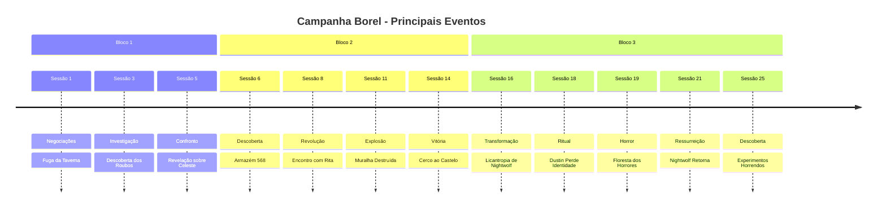

# 📋 Exemplos Práticos de Implementação - Quartz RPG

Este documento contém exemplos práticos e templates prontos para implementar as melhorias sugeridas.

## 🎯 Template de Frontmatter para Sessões

### Template Completo
```yaml
---
title: "Sessão [NÚMERO] - [TÍTULO]"
date: YYYY-MM-DD
sessao: [NÚMERO]
tags:
  - rpg/borel
  - tipo/sessao
  - sessao/[NÚMERO]
  - status/ativo
personagens:
  - [Lista de personagens presentes]
locais:
  - [Locais visitados]
plots:
  - [Plots relacionados]
eventos:
  - [Tipos de eventos: batalha, transformacao, traicao, etc]
resumo: "[Resumo curto em uma linha]"
description: "[Descrição mais detalhada para busca]"
---
```

### Exemplo Real - Sessão 25
```yaml
---
title: "Sessão 25 - O Legado de Rilonde: Os Horrores Subterrâneos e a Purificação"
date: 2025-03-17
sessao: 25
tags:
  - rpg/borel
  - tipo/sessao
  - sessao/25
  - status/ativo
  - evento/transformacao
  - evento/batalha
  - evento/ritual
personagens:
  - Orestan
  - Bartrock
  - Tony
  - Dustin
  - Groih
locais:
  - Londe
  - Caverna Subterrânea
  - Santuário de Córdia
plots:
  - Os Experimentos Horrendos
  - A Transformação de Bartrock em Ovelha
  - A Purificação de Uruk
eventos:
  - Transformação
  - Batalha
  - Ritual
  - Descoberta
resumo: "Grupo descobre instalação de experimentos horrendos, Orestan purifica Uruk, Bartrock desaparece e é substituído por ovelha"
description: "Na sessão 25, o grupo explora uma caverna subterrânea em Londe e descobre uma instalação onde pessoas são transformadas em criaturas modificadas. Orestan realiza um ritual perigoso para purificar seu amigo Uruk, e o grupo descobre que Bartrock desapareceu durante o descanso, sendo substituído por uma ovelha com cheiro podre."
---
```

---

## 👤 Template de Frontmatter para Personagens

### Template Completo
```yaml
---
title: "[NOME DO PERSONAGEM]"
type: personagem
tags:
  - rpg/borel
  - tipo/personagem
  - personagem/[nome-lowercase]
  - status/[ativo/inativo/morto]
classe: "[Classe]"
nivel: [Nível atual]
status: "[Status atual do personagem]"
primeira-aparicao: "Sessão [NÚMERO]"
ultima-aparicao: "Sessão [NÚMERO]"
plots-relacionados:
  - [Lista de plots]
aliases:
  - [Outros nomes/alcunhas]
---
```

### Exemplo Real - Nightwolf
```yaml
---
title: "Nightwolf"
type: personagem
tags:
  - rpg/borel
  - tipo/personagem
  - personagem/nightwolf
  - status/ativo
  - evento/resurreicao
classe: Ranger
nivel: [atualizar]
status: "Curado da licantropia, ressuscitado com vida máxima reduzida pela metade"
primeira-aparicao: "Sessão 1"
ultima-aparicao: "Sessão 25"
plots-relacionados:
  - A Maldição de Nightwolf
  - A Ressurreição de Nightwolf
aliases:
  - NightWolf
  - Biel
---
```

---

## 📖 Template de Frontmatter para Plots

### Template Completo
```yaml
---
title: "[NOME DO PLOT]"
type: plot
tags:
  - rpg/borel
  - tipo/plot
  - plot/[slug-do-plot]
  - status/[ativo/resolvido/pendente]
status: "[Status detalhado]"
urgencia: "[Crítica/Alta/Média/Baixa/N/A]"
inicio: "Sessão [NÚMERO]"
resolucao: "Sessão [NÚMERO]" # Se resolvido
personagens:
  - [Personagens envolvidos]
locais:
  - [Locais relacionados]
descricao: "[Descrição do plot]"
---
```

### Exemplo Real - A Possessão de Bartrock
```yaml
---
title: "A Possessão de Bartrock"
type: plot
tags:
  - rpg/borel
  - tipo/plot
  - plot/possessao-bartrock
  - status/ativo
  - evento/transformacao
status: "Ativo - Máscara Perdida (Sessão 19), Bartrock afirma ter encontrado"
urgencia: "Crítica"
inicio: "Sessão 16"
personagens:
  - Bartrock
  - Tony
locais:
  - Floresta dos Horrores
  - Londe
descricao: "Bartrock foi possuído por uma entidade através de uma máscara metálica. A máscara se recusou a participar de canibalismo e caiu. Bartrock afirma ter encontrado a máscara novamente, mas o grupo duvida."
---
```

---

## 🏰 Template de Frontmatter para Locais

### Template Completo
```yaml
---
title: "[NOME DO LOCAL]"
type: local
tags:
  - rpg/borel
  - tipo/local
  - local/[nome-lowercase]
status: "[Status: ativo/destruído/abandonado]"
controlado-por: "[Quem controla]"
visitado-em:
  - "Sessão [NÚMERO]"
descricao: "[Descrição do local]"
---
```

### Exemplo Real - Londe
```yaml
---
title: "Londe"
type: local
tags:
  - rpg/borel
  - tipo/local
  - local/londe
status: "Ativo"
controlado-por: "Conselho Arcano"
visitado-em:
  - "Sessão 18"
  - "Sessão 20"
  - "Sessão 25"
descricao: "Cidade da magia com universidade arcana e círculos de teletransporte. Local de investigação sobre os experimentos horrendos."
---
```

---

## 📑 Exemplo de Página de Cronologia

```markdown
---
title: Cronologia da Campanha
tags:
  - rpg/borel
  - tipo/indice
  - cronologia
---

# 📅 Cronologia Completa da Campanha Borel

## Por Sessão

### Bloco 1: Início da Jornada (Sessões 1-5)
- [[Sessoes/Capitulo 1 - Negociacoes frustradas|Sessão 1]] - Negociações Frustradas
- [[Sessoes/Capitulo 2 - Um Encontro na cabana|Sessão 2]] - Um Encontro na Cabana
- [[Sessoes/Capitulo 3 - Entre Dados e Desconfianças|Sessão 3]] - Entre Dados e Desconfianças
- [[Sessoes/Capitulo 4 - Noite na Cidade|Sessão 4]] - Noite na Cidade
- [[Sessoes/Capitulo 5 -  Entre Rastros, Risadas e Revelações no Templo|Sessão 5]] - Entre Rastros, Risadas e Revelações no Templo

### Bloco 2: A Revolução (Sessões 6-15)
- [[Sessoes/Capitulo 6 - Investigações e Revelações|Sessão 6]] - Investigações e Revelações
- [[Sessoes/Capitulo 7 - A Carroça Misteriosa|Sessão 7]] - A Carroça Misteriosa
- [[Sessoes/Capitulo 8 - Sussurros de Revolta|Sessão 8]] - Sussurros de Revolta
- [[Sessoes/Capitulo 9 - O Preço da Lealdade|Sessão 9]] - O Preço da Lealdade
- [[Sessoes/Capitulo 10 - Sombras no Cais|Sessão 10]] - Sombras no Cais
- [[Sessoes/Capitulo 11 -Sombras e Pólvora|Sessão 11]] - Sombras e Pólvora
- [[Sessoes/Capitulo 12 – Explosões e Estratégias|Sessão 12]] - Explosões e Estratégias
- [[Sessoes/Capitulo 13 – O Fogo da Revolta|Sessão 13]] - O Fogo da Revolta
- [[Sessoes/Capitulo 14 – O Cerco Final|Sessão 14]] - O Cerco Final
- [[Sessoes/Capitulo 15 – Sombras e Fugas|Sessão 15]] - Sombras e Fugas

### Bloco 3: Transformações (Sessões 16-25)
- [[Sessoes/Capitulo 16 – Sombras do Passado|Sessão 16]] - Sombras do Passado
- [[Sessoes/Capitulo 17 - Entre Cordas e Confissões|Sessão 17]] - Entre Cordas e Confissões
- [[Sessoes/Capitulo 18 - Parte 1 - Nas Estradas para o Santuario|Sessão 18]] - Jornada para Londe
- [[Sessoes/Capitulo 19 - Parte 1 - O Encontro na Floresta dos Horrores|Sessão 19]] - A Floresta dos Horrores
- [[Sessoes/sessao 20_bloco01_resumo|Sessão 20]] - O Legado de Rilonde: Marcas do Ritual
- [[Sessoes/sessao 21_bloco02_resumo|Sessão 21]] - O Ritual da Ressurreição e a Traição
- [[Sessoes/sessao 22_bloco01_resumo|Sessão 22]] - A Batalha das Minhocas Gigantes
- [[Sessoes/sessao 23_bloco01_resumo|Sessão 23]] - A Caverna dos Cogumelos e os Golems Elementais
- [[Sessoes/sessao 24_bloco01_resumo|Sessão 24]] - O Legado de Rilonde: A Batalha Final dos Golems Elementais
- [[Sessoes/sessao 25_bloco01_resumo|Sessão 25]] - O Legado de Rilonde: Os Horrores Subterrâneos

## Por Evento

### 🐺 Transformações
- **Sessão 16**: Nightwolf revela licantropia
- **Sessão 18**: Dustin perde identidade no ritual da travessia
- **Sessão 19**: Bartrock transformado pela máscara metálica
- **Sessão 21**: Nightwolf ressuscitado por Bartrock
- **Sessão 25**: Bartrock desaparece e é substituído por ovelha

### ⚔️ Batalhas Épicas
- **Sessão 14**: Cerco ao Castelo de Alva Cidadela
- **Sessão 19**: Batalha contra criatura monstruosa na Floresta dos Horrores
- **Sessão 22**: Batalha contra minhocas gigantes
- **Sessão 23-24**: Batalha contra golems elementais

### 🎭 Traições
- **Sessão 9**: Kaelion trai o grupo avisando Rita
- **Sessão 21**: Cerberus revela traição e prende o grupo

### 💀 Mortes e Ressurreições
- **Sessão 2**: Morte de Nikov e Lord Bart
- **Sessão 21**: Ressurreição de Nightwolf

## Timeline Visual



## Links Rápidos

- [[index|Voltar ao Índice Principal]]
- [[Plots/index|Ver Todos os Plots]]
- [[Players/index|Ver Todos os Personagens]]
- [[Locais/index|Ver Todos os Locais]]
```

---

## 📊 Exemplo de Dashboard

```markdown
---
title: Dashboard da Campanha
tags:
  - rpg/borel
  - tipo/indice
  - dashboard
---

# 📊 Dashboard - Estado Atual da Campanha

> **Última Atualização**: Sessão 25

## 🎯 Plots Ativos

| Plot | Status | Urgência | Última Atualização | Link |
|------|--------|----------|-------------------|------|
| [[Plots/A Possessao de Bartrock|A Possessão de Bartrock]] | 🔴 Ativo | Crítica | Sessão 25 | [[Plots/A Possessao de Bartrock|Ver detalhes]] |
| [[Plots/Os Experimentos Horrendos|Os Experimentos Horrendos]] | 🔴 Ativo | Alta | Sessão 25 | [[Plots/Os Experimentos Horrendos|Ver detalhes]] |
| [[Plots/Conselho Arcano do Circo Vermelho|Conselho Arcano]] | 🟡 Ativo | Média | Sessão 25 | [[Plots/Conselho Arcano do Circo Vermelho|Ver detalhes]] |
| [[Plots/A Transformacao de Dustin|A Transformação de Dustin]] | 🟡 Ativo | Alta | Sessão 18 | [[Plots/A Transformacao de Dustin|Ver detalhes]] |

## 👥 Personagens

| Personagem | Status | Localização | Última Aparição |
|------------|--------|-------------|-----------------|
| [[Players/Nightwolf|Nightwolf]] | ✅ Ativo | Londe | Sessão 25 |
| [[Players/LordBart|Bartrock]] | ⚠️ Transformado | Desconhecido | Sessão 25 |
| [[Players/Tony|Tony]] | ✅ Ativo | Londe | Sessão 25 |
| [[Players/Dustin|Dustin]] | ✅ Ativo | Londe | Sessão 25 |
| [[Players/Orestan|Orestan]] | ✅ Ativo | Londe | Sessão 25 |
| [[Players/Groih|Groih]] | ✅ Ativo | Londe | Sessão 25 |
| [[Players/Borin|Borin]] | ❓ Status Desconhecido | - | Sessão 19 |
| [[Players/Kaelion|Kaelion]] | ❌ Separado | - | Sessão 9 |

## 🏰 Locais Importantes

| Local | Status | Controlado Por | Última Visita |
|-------|--------|----------------|---------------|
| [[Locais/Londe|Londe]] | ✅ Ativo | Conselho Arcano | Sessão 25 |
| [[Locais/Rilonde|Rilonde]] | ✅ Ativo | - | Sessão 17 |
| [[Locais/Elriste|Elriste]] | ⚠️ Em Revolução | Resistência | Sessão 15 |
| [[Locais/Alva Cidadela|Alva Cidadela]] | 🏰 Conquistada | Rita | Sessão 15 |

## 📈 Estatísticas da Campanha

- **Total de Sessões**: 25
- **Personagens Ativos**: 6
- **Plots Ativos**: 4
- **Plots Resolvidos**: 8
- **Locais Visitados**: 4 principais

## 🔗 Links Rápidos

- [[Cronologia|Ver Cronologia Completa]]
- [[Plots/index|Ver Todos os Plots]]
- [[Players/index|Ver Todos os Personagens]]
- [[Locais/index|Ver Todos os Locais]]
- [[Sessoes/index|Ver Todas as Sessões]]
```

---

## 🏷️ Exemplo de Uso de Tags

### Em uma Sessão
```markdown
---
title: "Sessão 25 - Os Horrores Subterrâneos"
tags:
  - rpg/borel
  - tipo/sessao
  - sessao/25
  - status/ativo
  - evento/transformacao
  - evento/batalha
  - evento/ritual
  - personagem/bartrock
  - personagem/orestan
  - plot/experimentos-horrendos
  - local/londe
---
```

### Em um Personagem
```markdown
---
title: "Nightwolf"
tags:
  - rpg/borel
  - tipo/personagem
  - personagem/nightwolf
  - status/ativo
  - evento/resurreicao
  - plot/licantropia
---
```

### Em um Plot
```markdown
---
title: "A Possessão de Bartrock"
tags:
  - rpg/borel
  - tipo/plot
  - plot/possessao-bartrock
  - status/ativo
  - evento/transformacao
  - personagem/bartrock
  - urgencia/critica
---
```

---

## 🔗 Exemplo de Links Contextuais

### Em uma Sessão
```markdown
Durante a sessão, [[Players/LordBart|Bartrock]] desapareceu misteriosamente. 
O grupo descobriu que ele foi substituído por uma ovelha, relacionado ao plot 
[[Plots/A Possessao de Bartrock|A Possessão de Bartrock]].

O evento aconteceu em [[Locais/Londe|Londe]], especificamente na caverna 
subterrânea onde [[Plots/Os Experimentos Horrendos|os experimentos horrendos]] 
estavam sendo realizados.
```

### Em um Plot
```markdown
Este plot envolve principalmente [[Players/LordBart|Bartrock]], mas também 
afeta [[Players/Tony|Tony]] e o resto do grupo.

O plot começou na [[Sessoes/Capitulo 16 – Sombras do Passado|Sessão 16]] e 
continua ativo até a [[Sessoes/sessao 25_bloco01_resumo|Sessão 25]].

Eventos relacionados:
- [[Sessoes/Capitulo 19 - Parte 2 - A Transformacao de Bartrok|Transformação de Bartrock]]
- [[Sessoes/sessao 25_bloco01_resumo|Desaparecimento de Bartrock]]
```

---

## 📝 Script de Migração (Pseudocódigo)

```javascript
// Exemplo de script para adicionar frontmatter automaticamente
// (Precisa ser adaptado para seu ambiente)

function addFrontmatterToSession(filePath, sessionNumber) {
  const content = readFile(filePath);
  
  const frontmatter = {
    title: extractTitle(content),
    date: extractDate(content),
    sessao: sessionNumber,
    tags: [
      'rpg/borel',
      'tipo/sessao',
      `sessao/${sessionNumber}`,
      'status/ativo'
    ],
    personagens: extractCharacters(content),
    locais: extractLocations(content),
    plots: extractPlots(content),
    eventos: extractEvents(content),
    resumo: extractSummary(content),
    description: generateDescription(content)
  };
  
  const newContent = yamlToFrontmatter(frontmatter) + '\n' + content;
  writeFile(filePath, newContent);
}
```

---

## ✅ Checklist de Aplicação

### Fase 1: Preparação
- [ ] Revisar todos os arquivos existentes
- [ ] Identificar padrões de nomenclatura
- [ ] Criar lista de tags padronizadas
- [ ] Definir estrutura de frontmatter

### Fase 2: Implementação
- [ ] Adicionar frontmatter em arquivos principais (index.md)
- [ ] Adicionar frontmatter em todas as sessões
- [ ] Adicionar frontmatter em todos os personagens
- [ ] Adicionar frontmatter em todos os plots
- [ ] Adicionar frontmatter em todos os locais

### Fase 3: Melhorias
- [ ] Criar página de Cronologia
- [ ] Criar Dashboard
- [ ] Melhorar links entre documentos
- [ ] Adicionar tags em todos os arquivos
- [ ] Testar navegação

### Fase 4: Validação
- [ ] Verificar todos os links
- [ ] Testar busca
- [ ] Validar tags
- [ ] Testar em diferentes dispositivos
- [ ] Revisar com grupo

---

*Templates prontos para implementação no projeto Quartz RPG Borel*
