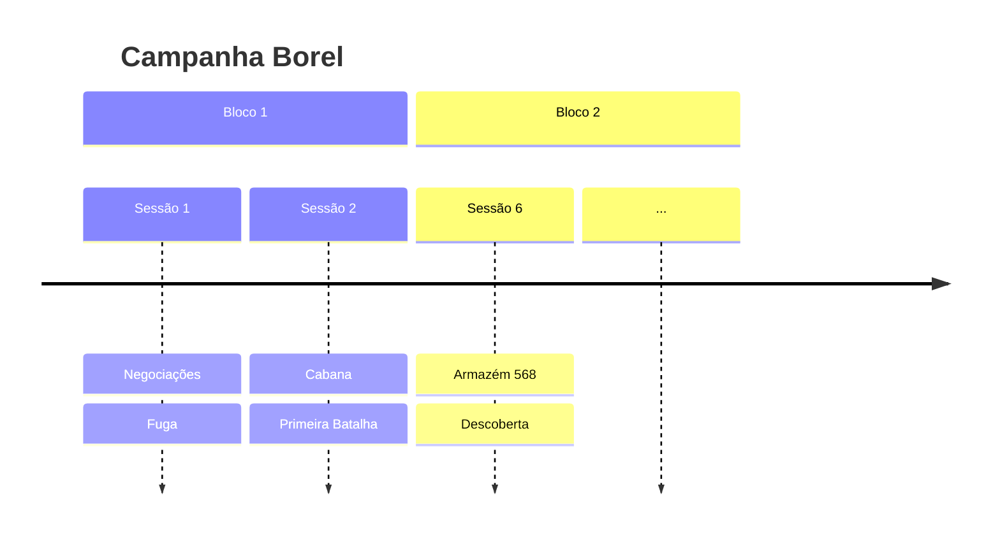
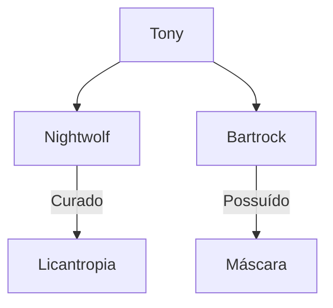
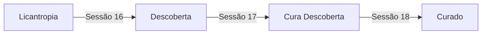

# 🎯 Melhorias para o Projeto Quartz - RPG Borel

Este documento detalha melhorias específicas para aproveitar ao máximo as capacidades do Quartz no contexto de documentação de RPG.

## 📋 Índice
1. [Sistema de Tags Estruturado](#sistema-de-tags)
2. [Frontmatter Padronizado](#frontmatter-padronizado)
3. [Componentes Customizados](#componentes-customizados)
4. [Páginas de Índice Especializadas](#páginas-de-índice)
5. [Navegação e Links](#navegação-e-links)
6. [Busca e Filtros](#busca-e-filtros)
7. [Visualizações e Gráficos](#visualizações)
8. [Otimizações de Performance](#otimizações)

---

## 🏷️ Sistema de Tags Estruturado

### Problema Atual
- Tags não estão sendo utilizadas de forma sistemática
- Falta organização hierárquica de tags
- Dificulta navegação e descoberta de conteúdo relacionado

### Solução: Hierarquia de Tags

#### Tags Principais (Categorias)
```
#rpg/borel
#tipo/sessao
#tipo/personagem
#tipo/local
#tipo/plot
#tipo/npc
```

#### Tags de Status (Para Plots)
```
#status/ativo
#status/resolvido
#status/pendente
#status/critico
```

#### Tags de Sessão
```
#sessao/01
#sessao/02
#sessao/03
...
#sessao/25
```

#### Tags de Personagens
```
#personagem/borin
#personagem/bartrock
#personagem/nightwolf
#personagem/tony
#personagem/dustin
#personagem/kaelion
#personagem/orestan
#personagem/groih
```

#### Tags de Locais
```
#local/rilonde
#local/elriste
#local/alva-cidadela
#local/londe
```

#### Tags de Plots
```
#plot/licantropia
#plot/possessao-bartrock
#plot/revolucao-elriste
#plot/experimentos
```

#### Tags de Eventos
```
#evento/batalha
#evento/transformacao
#evento/morte
#evento/resurreicao
#evento/traicao
```

### Implementação
1. Adicionar tags em todos os arquivos markdown
2. Usar `Plugin.TagPage()` já configurado no Quartz
3. Criar páginas de índice por tag principal

---

## 📄 Frontmatter Padronizado

### Estrutura Recomendada

#### Para Sessões
```yaml
---
title: "Sessão 25 - O Legado de Rilonde: Os Horrores Subterrâneos"
date: 2025-03-17
sessao: 25
tags:
  - rpg/borel
  - tipo/sessao
  - sessao/25
  - status/ativo
personagens:
  - Borin
  - Bartrock
  - Nightwolf
  - Tony
  - Dustin
  - Orestan
  - Groih
locais:
  - Londe
  - Caverna Subterrânea
plots:
  - Os Experimentos Horrendos
  - A Transformação de Bartrock
  - A Purificação de Uruk
eventos:
  - Transformação
  - Batalha
  - Ritual
resumo: "Grupo descobre instalação de experimentos horrendos e resgata Uruk"
---
```

#### Para Personagens
```yaml
---
title: "Nightwolf"
type: personagem
tags:
  - rpg/borel
  - tipo/personagem
  - personagem/nightwolf
  - status/ativo
classe: Ranger
nivel: [atualizar conforme necessário]
status: "Curado da licantropia, ressuscitado"
primeira-aparicao: "Sessão 1"
ultima-aparicao: "Sessão 25"
plots-relacionados:
  - A Maldição de Nightwolf
  - A Ressurreição de Nightwolf
---
```

#### Para Plots
```yaml
---
title: "A Maldição de Nightwolf"
type: plot
tags:
  - rpg/borel
  - tipo/plot
  - plot/licantropia
  - status/resolvido
status: "Resolvido - Curado na Sessão 18"
urgencia: "N/A"
inicio: "Sessão 16"
resolucao: "Sessão 18"
personagens:
  - Nightwolf
  - Bartrock
---
```

#### Para Locais
```yaml
---
title: "Londe"
type: local
tags:
  - rpg/borel
  - tipo/local
  - local/londe
status: "Ativo"
controlado-por: "Conselho Arcano"
visitado-em:
  - "Sessão 18"
  - "Sessão 20"
  - "Sessão 25"
---
```

---

## 🧩 Componentes Customizados

### Componentes Sugeridos para Quartz

#### 1. Status Badge Component
Criar componente para exibir status de plots/personagens:
```typescript
// quartz/components/StatusBadge.tsx
export function StatusBadge({ status, urgency }: { status: string, urgency?: string }) {
  const colors = {
    ativo: "blue",
    resolvido: "green",
    critico: "red",
    pendente: "yellow"
  }
  // Implementação...
}
```

#### 2. Timeline Component
Componente para exibir linha do tempo de eventos:
```typescript
// quartz/components/Timeline.tsx
export function Timeline({ events }: { events: Event[] }) {
  // Renderiza timeline visual
}
```

#### 3. Plot Status Dashboard
Componente que mostra todos os plots ativos:
```typescript
// quartz/components/PlotDashboard.tsx
export function PlotDashboard({ plots }: { plots: Plot[] }) {
  // Dashboard interativo de plots
}
```

#### 4. Character Card Component
Card visual para personagens:
```typescript
// quartz/components/CharacterCard.tsx
export function CharacterCard({ character }: { character: Character }) {
  // Card com informações do personagem
}
```

### Como Implementar
1. Criar arquivos em `source/quartz/components/`
2. Registrar no `quartz.layout.ts`
3. Usar nos arquivos markdown via shortcodes ou componentes

---

## 📑 Páginas de Índice Especializadas

### 1. Cronologia Interativa
**Arquivo:** `source/content/Borel/Cronologia.md`

```markdown
---
title: Cronologia da Campanha
tags:
  - rpg/borel
  - tipo/indice
---

# Cronologia Completa da Campanha

## Por Sessão
- [[Sessoes/Capitulo 1 - Negociacoes frustradas|Sessão 1]] - Negociações Frustradas
- [[Sessoes/Capitulo 2 - Um Encontro na cabana|Sessão 2]] - Um Encontro na Cabana
...

## Por Evento
### Transformações
- Sessão 16: Nightwolf revela licantropia
- Sessão 18: Dustin perde identidade
- Sessão 19: Bartrock transformado pela máscara
...

### Batalhas Épicas
- Sessão 14: Cerco ao Castelo
- Sessão 19: Floresta dos Horrores
- Sessão 22: Batalha das Minhocas
...
```

### 2. Dashboard de Status
**Arquivo:** `source/content/Borel/Dashboard.md`

```markdown
---
title: Dashboard da Campanha
tags:
  - rpg/borel
  - tipo/indice
---

# Dashboard - Estado Atual da Campanha

## Plots Ativos
| Plot | Status | Urgência | Última Atualização |
|------|--------|----------|-------------------|
| [[Plots/A Possessao de Bartrock|A Possessão de Bartrock]] | Ativo | Crítica | Sessão 25 |
| [[Plots/Os Experimentos Horrendos|Os Experimentos Horrendos]] | Ativo | Alta | Sessão 25 |
...

## Personagens
| Personagem | Status | Localização |
|------------|--------|-------------|
| [[Players/Nightwolf|Nightwolf]] | Ativo | Londe |
...
```

### 3. Índice de Citações
**Arquivo:** `source/content/Borel/Citacoes.md`

```markdown
---
title: Citações Memoráveis
tags:
  - rpg/borel
  - tipo/indice
---

# Citações Memoráveis da Campanha

## Por Personagem
### Nightwolf
> "Citação memorável" - [[Sessoes/Capitulo X|Sessão X]]

## Por Sessão
### Sessão 19
> "Citação" - Personagem
```

### 4. Mapa de Relacionamentos
**Arquivo:** `source/content/Borel/Relacionamentos.md`

```markdown
---
title: Mapa de Relacionamentos
tags:
  - rpg/borel
  - tipo/indice
---

# Relacionamentos entre Personagens

## Entre PCs
- **Tony ↔ Nightwolf**: Aliados próximos
- **Bartrock ↔ Grupo**: Tensão crescente devido à possessão

## Entre PCs e NPCs
- **Rita ↔ Grupo**: Líder revolucionária (desaparecida)
...
```

---

## 🔗 Navegação e Links

### Melhorias de Navegação

#### 1. Breadcrumbs Customizados
O Quartz já tem breadcrumbs, mas podemos melhorar:
- Adicionar contexto (ex: "Borel > Sessões > Sessão 25")
- Links para categorias relacionadas

#### 2. Links Contextuais
Usar `[[wikilinks]]` do Obsidian que o Quartz suporta:
```markdown
Durante a [[Sessoes/Capitulo 19 - Parte 2 - A Transformacao de Bartrok|transformação]], 
[[Players/LordBart|Bartrock]] encontrou a [[Plots/A Possessao de Bartrock|máscara]].
```

#### 3. Backlinks Melhorados
O Quartz já mostra backlinks, mas podemos:
- Organizar por tipo (sessões, plots, personagens)
- Adicionar contexto sobre a relação

#### 4. Shortcodes Customizados
Criar shortcodes para elementos comuns:
```markdown
{{ character: Nightwolf }}
{{ plot: A Maldição de Nightwolf }}
{{ session: 25 }}
{{ location: Londe }}
```

---

## 🔍 Busca e Filtros

### Melhorias na Busca

#### 1. Filtros por Tipo
O Quartz já tem busca, mas podemos adicionar:
- Filtro por tipo de conteúdo (sessão, personagem, plot)
- Filtro por tags
- Filtro por data/sessão

#### 2. Busca Semântica
Usar descrições no frontmatter para melhorar resultados:
```yaml
description: "Sessão onde o grupo descobre os experimentos horrendos e resgata Uruk"
```

#### 3. Índice de Busca Rápida
Criar página com links rápidos:
```markdown
## Busca Rápida
- [[Sessoes/|Todas as Sessões]]
- [[Players/|Todos os Personagens]]
- [[NPCs/|Todos os NPCs]]
- [[Plots/|Todos os Plots]]
- [[Locais/|Todos os Locais]]
```

---

## 📊 Visualizações e Gráficos

### Usando Mermaid (já suportado pelo Quartz)

#### 1. Timeline de Sessões
```markdown

```

#### 2. Gráfico de Relacionamentos
```markdown

```

#### 3. Fluxo de Plots
```markdown

```

---

## ⚡ Otimizações de Performance

### 1. Lazy Loading de Imagens
O Quartz já otimiza imagens, mas podemos:
- Usar formato WebP quando possível
- Adicionar `loading="lazy"` nas imagens grandes

### 2. Paginação de Listas
Para páginas com muitos itens (ex: todas as sessões):
- Implementar paginação
- Ou usar componentes de lista colapsável

### 3. Cache de Busca
O Quartz usa FlexSearch, mas podemos:
- Otimizar índices de busca
- Adicionar mais campos pesquisáveis

### 4. Compressão de Assets
- Verificar se imagens estão otimizadas
- Usar CDN se necessário

---

## 🎨 Melhorias Visuais

### 1. Tema Customizado
Ajustar cores no `quartz.config.ts`:
```typescript
theme: {
  colors: {
    lightMode: {
      secondary: "#284b63", // Cor temática do RPG
      highlight: "rgba(143, 159, 169, 0.15)",
    },
    darkMode: {
      // Tema escuro para leitura noturna
    }
  }
}
```

### 2. Ícones e Emojis
Usar emojis consistentes:
- 🎲 Para sessões
- 👤 Para personagens
- 🏰 Para locais
- 📖 Para plots
- 👹 Para NPCs

### 3. Callouts Especiais
Usar callouts do Obsidian (suportado pelo Quartz):
```markdown
> [!info] Informação
> Texto informativo

> [!warning] Aviso
> Texto de aviso

> [!tip] Dica
> Texto de dica

> [!note] Nota
> Texto de nota
```

---

## 📱 Melhorias Mobile

### 1. Layout Responsivo
O Quartz já é responsivo, mas podemos:
- Testar em diferentes tamanhos de tela
- Ajustar componentes para mobile

### 2. Menu Mobile
- Verificar se o menu mobile está otimizado
- Adicionar atalhos rápidos

---

## 🔧 Configurações Técnicas

### 1. Atualizar Configuração Base
```typescript
// quartz.config.ts
baseUrl: "seu-dominio.com", // Atualizar com seu domínio real
locale: "pt-BR", // Mudar para português
```

### 2. Analytics
Já configurado com Plausible, mas podemos:
- Adicionar eventos customizados
- Rastrear páginas mais visitadas

### 3. RSS Feed
Já habilitado, mas podemos:
- Organizar por categorias
- Adicionar mais metadados

---

## 📝 Checklist de Implementação

### Prioridade Alta
- [ ] Adicionar frontmatter padronizado em todos os arquivos
- [ ] Implementar sistema de tags hierárquico
- [ ] Criar página de Cronologia
- [ ] Criar Dashboard de Status
- [ ] Melhorar links entre documentos

### Prioridade Média
- [ ] Criar componentes customizados (StatusBadge, Timeline)
- [ ] Adicionar descrições em todos os frontmatters
- [ ] Criar índice de Citações
- [ ] Implementar shortcodes customizados
- [ ] Adicionar gráficos Mermaid

### Prioridade Baixa
- [ ] Otimizar imagens
- [ ] Customizar tema visual
- [ ] Adicionar mais callouts
- [ ] Melhorar mobile experience
- [ ] Adicionar mais metadados

---

## 🚀 Próximos Passos

1. **Começar com Frontmatter**: Adicionar frontmatter padronizado em arquivos principais
2. **Implementar Tags**: Criar hierarquia de tags e aplicar
3. **Criar Índices**: Desenvolver páginas de índice especializadas
4. **Melhorar Links**: Garantir que todos os links estejam funcionando
5. **Testar e Iterar**: Testar navegação e fazer ajustes

---

## 📚 Recursos Úteis

- [Documentação do Quartz](https://quartz.jzhao.xyz/)
- [Obsidian Flavored Markdown](https://quartz.jzhao.xyz/features/obsidian-flavored-markdown)
- [Componentes do Quartz](https://quartz.jzhao.xyz/configuration/plugins)
- [Mermaid Diagrams](https://mermaid.js.org/)

---

*Documento criado para otimizar o uso do Quartz no projeto RPG Borel*
