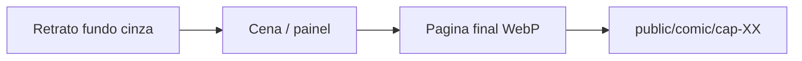

# Style Bible — O Legado de Rilonde (quadrinho)

Documento **fonte da verdade** para gerar arte no ChatGPT. Baseado no [[AI_Tool_Comparison/03_Decisao|bake-off ChatGPT T1–T5]].

---

## Cap. 1 — estilo aprovado (jun/2026)

A mesa aprovou o visual **webcomic cel-shade** (testes tapa + Dustin *Traidor!*) para o piloto de 10 páginas.

| Item | Onde |
|------|------|
| Guia completo + prefixo/Avoid | [[02_Chapters/cap-01-negociacoes-frustradas/style-tirinha|style-tirinha.md]] |
| Prompt 10 páginas | [[02_Chapters/cap-01-negociacoes-frustradas/prompt-all-pages-tirinha|prompt-all-pages-tirinha.md]] |
| Refs de estilo | `Referencias/style/cap-01-estilo-aprovado-tapa.png`, `cap-01-estilo-aprovado-dustin-traidor.png` |

**Regra:** ao gerar Cap. 1, anexar **2 refs de estilo + 4 refs de personagem** (ver prompt). Não usar o prefixo graphic novel abaixo neste capítulo.

Outros capítulos / retratos novos: continuam com **T2** (graphic novel) até a mesa aprovar outro registro.

---

## Ferramenta e entrega

| Item | Valor |
|------|--------|
| **Ferramenta** | ChatGPT Plus (GPT Image) |
| **Lettering** | **Na IA** — balões e texto em português no prompt |
| **Formato de página** | PNG ou WebP, largura alvo **1400px** (altura conforme painel) |
| **Publicação** | Site privado — `source/public/comic/cap-XX/001.webp` … |
| **Não usar** | PDF, tags “Magic: The Gathering”, “D&D art”, anime, photorealistic |

---

## Direção visual (o que a mesa aprovou)

O bake-off mostrou registros aceitáveis; o projeto usa **dois looks** conforme o capítulo:

| Tipo | Referência | Descrição | Quando |
|------|------------|-----------|--------|
| **Cap. 1 webcomic** | `Referencias/style/cap-01-estilo-aprovado-*.png` | Cel-shade, contorno preto, taverna quente, balões legíveis | **Cap. 1** (10 pág. multi-painel) |
| **Ambiente** | [[AI_Tool_Comparison/results/chatgpt-image/T1-taverna.png\|T1]] | Graphic novel, hachura, taverna quente | Cenários sem elenco fixo |
| **Personagens** | [[AI_Tool_Comparison/results/chatgpt-image/T2-tony-retrato.png\|T2]], [[AI_Tool_Comparison/results/chatgpt-image/T2b-nightwolf-retrato.png\|T2b]] | Ilustração digital cinematográfica, retratos | Retratos `eq-*`, caps futuros |

**Regra prática:** Cap. 1 → prefixo em [[02_Chapters/cap-01-negociacoes-frustradas/style-tirinha|style-tirinha]]. Demais caps → **T2** até nova aprovação da mesa.

### Paleta e mood

- Tons **terra, bronze, marrom, verde escuro**, metal envelhecido
- Luz **quente** (velas, tocha, lareira) ou **rim light** em cavernas
- Mood: RPG de mesa — aventura, tensão, humor permitido; sem gore extremo salvo cena exigir

### Proporções

- Semi-realista heroic fantasy
- Cabeças e mãos proporcionais; evitar anatomia exagerada tipo anime

---

## Blocos de prompt (copiar em toda geração)

### Prefixo de estilo (obrigatório)

Colar no **início** de cada mensagem ChatGPT:

```
Generate an image. European fantasy graphic novel style, detailed digital illustration, inked influences, cel shading influences, muted earth and bronze palette, medieval fantasy, cinematic lighting, comic book art, clear silhouettes.
```

### Linha Avoid (obrigatória)

Colar no **final** de cada mensagem:

```
Avoid: photorealistic, anime, 3d render, watermark, logo, blurry, extra fingers, extra arms, deformed hands, bad anatomy, English text unless specified, gibberish letters, illegible font.
```

### Ajustes Avoid por tipo

| Tipo | Adicionar ao Avoid |
|------|-------------------|
| Retrato | text, speech bubble, caption |
| Cena sem fala | text, speech bubble |
| Cena com fala | misspelled Portuguese, multiple speech bubbles, text outside bubble |
| Ambiente vazio | people, characters |
| Nightwolf (ranger) | werewolf, full wolf head, furry (salvo variante aprovada) |

---

## Nomes canônicos

Sempre usar **nome do personagem** no prompt. Ficha em [[01_Cast_Model_Sheets/index|model sheets]]:

- **Identidade LOCKED** (rosto, corpo) — quase não muda
- **Equipamento `eq-*`** (armadura, armas) — atualiza quando o jogo avança → [[01_Cast_Model_Sheets/00_Equipamento_Evolucao|evolução de equipamento]]

Colar identidade + loadout do capítulo após o prefixo. Anexar ref `Referencias/pcs/<nome>-<eq-id>.webp` do período correto.

| Nome no prompt | Personagem | Ref aprovada (bake-off / vault) |
|----------------|------------|----------------------------------|
| **Tony Tigger** (Tony) | [[../Players/Tony\|Tony]] | [[../Referencias/pcs/tony-eq-inicial.png\|tony-eq-inicial]] |
| **Nightwolf** | [[../Players/Nightwolf\|Nightwolf]] | [[../Referencias/pcs/nightwolf-eq-inicial.png\|nightwolf-eq-inicial]] |
| **Dustin** | [[../Players/Dustin\|Dustin]] | [[../Referencias/pcs/dustin-eq-inicial.png\|dustin-eq-inicial]] |
| **Kaelion** | [[../Players/Kaelion\|Kaelion]] | [[../Referencias/pcs/kaelion-eq-inicial.png\|kaelion-eq-inicial]] |
| **Bartrock** | [[../Players/LordBart\|Bartrock]] (jogador Bart) | **Lord Bart** `noble` [[../Referencias/pcs/bartrock-noble-eq-inicial.png\|noble]] · `normal` · `possessed` |
| **Borin** | [[../Players/Borin\|Borin]] | [[../Referencias/pcs/borin-eq-inicial.png\|borin-eq-inicial]] (solo) · [[../Referencias/pcs/borin-trash-eq-inicial.png\|borin-trash-eq-inicial]] (duo) |
| **Trash** | [[../NPCs/Trash\|Trash]] | [[../Referencias/pcs/trash-eq-inicial.png\|trash-eq-inicial]] (solo) · [[../Referencias/pcs/borin-trash-eq-inicial.png\|borin-trash-eq-inicial]] (duo) |
| **Groih** | [[../Players/Groih\|Groih]] | [[../Referencias/pcs/groih-eq-inicial.png\|groih-eq-inicial]] |
| **Orestan** | [[../Players/Orestan\|Orestan]] | [[../Referencias/pcs/orestan-eq-inicial.png\|orestan-eq-inicial]] |

**NPCs:** nome completo na primeira linha do prompt; ref em `Referencias/npcs/` quando existir.

---

## Workflow ChatGPT



### 1. Retrato de personagem (novo PC ou NPC)

- **Uma conversa** ou thread dedicada por personagem
- Fundo **cinza neutro**, waist-up, facing camera
- Sem balão, sem texto
- Salvar: `Referencias/pcs/<nome>-<eq-id>.webp` (ex.: `tony-eq-inicial.webp`) ou `Referencias/npcs/<nome>-<eq-id>.webp`
- Atualizar **Histórico de equipamento** na model sheet quando o loadout mudar

**Modelo ChatGPT — copiar e adaptar `[NOME]` e traços:**

```
Generate an image. European fantasy graphic novel style, detailed digital illustration, inked influences, cel shading influences, muted earth and bronze palette, medieval fantasy, cinematic lighting, comic book art, clear silhouettes. Character portrait of [NOME COMPLETO], [raça/classe e 3 traços visuais fixos], waist-up, neutral gray background, facing camera, always call this character [NOME]. Clear silhouette, comic book character design.

Avoid: photorealistic, anime, 3d render, watermark, logo, blurry, text, speech bubble, caption, extra fingers, extra arms, blurry face, deformed hands, bad anatomy.
```

### 2. Cena sem diálogo

- **Mesma conversa do capítulo** (recomendado)
- Anexar refs de **todos** os personagens visíveis
- Texto: `I attached reference images for [lista]. Use them for faces and outfits.`

```
[SAME PREFIX]. Comic book panel. [CENA: local, ação, quem aparece, iluminação]. No text, no speech bubbles.

[SAME AVOID] + text, speech bubble.
```

### 3. Painel com fala (português)

- Texto do balão **entre aspas**, frase exata, sem paráfrase
- Indicar cauda do balão: `Tony Tigger's bubble`, `Nightwolf's bubble`
- Revisar ortografia na mesa antes de publicar

```
[SAME PREFIX]. Comic book panel. [CENA]. One speech bubble / Two speech bubbles: (1) [Nome]'s bubble, text exactly: "[PORTUGUÊS]". Hand-lettered comic font, Portuguese only, no other text.

[SAME AVOID] + misspelled Portuguese, English text, multiple speech bubbles, text outside bubble.
```

**Exemplo validado (T4):** `"Recua! Eu cubro a retaguarda."`  
**Exemplo validado (T5):** `"Fica atrás de mim."` / `"Sempre."`

### 4. Vários personagens

1. Gerar **retrato** de cada um (T2 / T2b)
2. No painel, anexar **todas** as refs na mesma mensagem
3. Listar: `first image is Tony Tigger, second is Nightwolf, …`

---

## Figurantes (Tier C)

Sem ref individual. Usar só prefixo +:

```
Generic medieval fantasy background characters, guards or townsfolk, simple silhouettes, not distinct named heroes, same art style as main cast.
```

---

## Páginas para o site

| Regra | Valor |
|-------|--------|
| Nomeação | `001.webp`, `002.webp`, … (3 dígitos) |
| Pasta | `source/public/comic/cap-XX-sessao-YY/` |
| Capa opcional | `000-cover.webp` |
| `chapters.json` | `fidelity`: `documented` (caps 3+) ou `reconstructed` (caps 1–2) |

---

## Checklist antes de publicar um capítulo

- [ ] Cada personagem visível tem ref em `Referencias/` ou model sheet
- [ ] Falas em PT conferidas palavra por palavra
- [ ] Mesma conversa ChatGPT ou prefixo idêntico em todos os painéis do cap
- [ ] Imagens exportadas na largura alvo
- [ ] Entrada em `chapters.json`

---

## Links

- Bake-off: [[AI_Tool_Comparison/00_Test_Prompts|Prompts de teste]]
- Decisão: [[AI_Tool_Comparison/03_Decisao|03_Decisao]]
- Plano geral: [[index|Comic index]]
- Prompts antigos (reescrever com este bible): [[../Players/Prompts_para_Imagens_Players|Players]], [[../NPCs/Prompts_para_Imagens_NPCs|NPCs]]

---

*Próximo passo: [[index#Fase 0.2 — Referências dos PCs (8)|Fase 0.2]] — mesa aprova LOCKED → gerar retratos ChatGPT → `Referencias/pcs/`*
