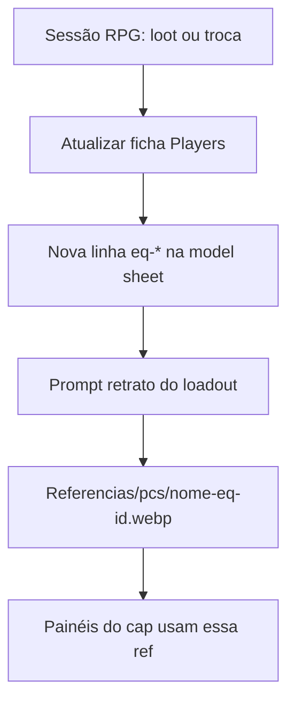

---
title: Equipamento — evolução com a campanha
type: comic
tags:
  - rpg/borel
  - tipo/comic
  - equipamento
---

# Equipamento que evolui com o jogo

A campanha muda armadura, armas e itens. O quadrinho precisa **duas camadas** na ficha de cada personagem — não misturar tudo num único “LOCKED” eterno.

## Duas camadas

| Camada | O que fixa | Quando muda |
|--------|------------|-------------|
| **Identidade LOCKED** | Rosto, cabelo, pele, orelhas, build, nome no prompt, expressão típica | Quase nunca (variantes: lobisomem, máscara, flashback) |
| **Loadout `eq-*`** | Armadura, capa, emblemas, armas visíveis, itens icônicos | Quando a mesa confirma loot / troca na sessão |

**Regra:** painéis de um capítulo usam o loadout **vigente naquela sessão**. Caps antigos mantêm a ref da época (não regerar em massa salvo decisão da mesa).

## ID de loadout

Formato: `eq-<slug-curto>`

| Exemplo | Significado |
|---------|-------------|
| `eq-inicial` | Primeiro retrato / início Vol. 1 |
| `eq-s18` | Estado após sessão 18 |
| `eq-cap03` | Estado fixo para todo o cap. 3 do quadrinho |

Registrar na ficha: **sessão RPG**, **capítulo quadrinho** (se já souber), **data**, **o que mudou**.

## Onde salvar refs

```
Referencias/pcs/<personagem>-<eq-id>.webp
Referencias/pcs/<personagem>-eq-atual.webp   ← cópia ou symlink do loadout corrente (opcional)
Referencias/pcs/archive/                     ← loadouts antigos se quiser limpar a pasta principal
```

NPCs: `Referencias/npcs/rita-eq-inicial.webp`

## Fluxo quando algo muda na mesa

1. Anotar na ficha do PC em [[../../Players/|Players/]] (já existe) **e** na model sheet do quadrinho.
2. Na model sheet: nova linha em **Histórico de equipamento** + bloco de prompt em inglês (ou link para [[01_Prompts_Retratos_ChatGPT]] se for o loadout ativo).
3. Marcar **Equipamento atual** = novo `eq-id`.
4. Gerar retrato ChatGPT só se o loadout for usado em caps novos (ou se a mudança for muito visível).
5. No roteiro do painel (`Panel_Script` futuro): campo `loadout: tony-eq-s25` para o artista/IA.



## Prompt ChatGPT

Montagem recomendada:

1. Prefixo ([[../00_Style_Bible#Prefixo de estilo|Style Bible]])
2. **Identidade LOCKED** (parágrafo curto — rosto, raça, build)
3. **Equipamento deste `eq-id`** (armadura, armas, emblemas)
4. `waist-up, neutral gray background…` (retrato)
5. Avoid (+ extras do personagem)

Não reutilizar retrato antigo como única ref se o escudo/armadura mudou — anexar a ref do **loadout correto** na conversa do capítulo.

## Caps já publicados

| Situação | Ação |
|----------|------|
| Cap já no site com loadout antigo | Deixar como está (canon visual daquele cap) |
| Correção de erro (ex.: cruz em vez de dado) | Novo `eq-id` + regerar só páginas afetadas |
| Retcon visual em cap antigo | Decisão explícita da mesa |

## Checklist por personagem

Cada ficha em `01_Cast_Model_Sheets/` deve ter:

- [ ] Seção **Identidade LOCKED**
- [ ] Seção **Equipamento atual** (`eq-id` + resumo)
- [ ] Tabela **Histórico de equipamento**
- [ ] Prompt(s) por loadout (ou link para arquivo mestre)
- [ ] Coluna **Ref** com caminho `Referencias/...`

Template: [[00_Template_Caracteristicas]]

## Exemplo

[[PC_Tony#Histórico de equipamento|Tony]] — `eq-inicial` (dado + escudo ornado normal + plate prateada).  
[[PC_Nightwolf#Histórico de equipamento|Nightwolf]] — `eq-inicial` (drow ranger + cicatriz + broche + adaga fumegante). Variante **identidade** `lycanthrope` (S16–20) — ref `nightwolf-lycanthrope-eq-inicial.png` — ver [[PC_Nightwolf#Variante `lycanthrope` (lobisomem híbrido)|Nightwolf]].

[[PC_Dustin#Histórico de equipamento|Dustin]] — `eq-inicial` (arco recurvo ornamentado + anel verde + adaga gema verde + couro segmentado).
