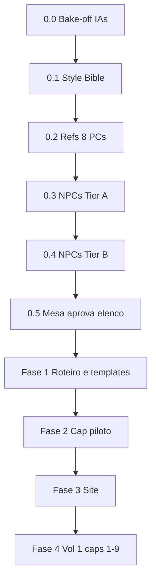

---
title: Quadrinho Borel
type: indice
tags:
  - rpg/borel
  - tipo/comic
  - tipo/indice
---

# Quadrinho — O Legado de Rilonde

Quadrinho digital **só para a mesa**: páginas numeradas em site privado (sem PDF, sem publicação). Plano completo abaixo — marque `- [x]` conforme for concluindo.

**Entrega:** imagens em `source/quartz/static/comic/cap-XX/001.webp` … + leitor em `/comic/` (cópia pós-build) ou `/static/comic/`.

**Leitor:** [[Leitor-Web|/comic/]] · **Cap. 0** [[02_Chapters/cap-00-elenco/README|Elenco]] (10 pág.) · **Cap. 1** [[02_Chapters/cap-01-negociacoes-frustradas/README|piloto]] · **Cap. 2** [[02_Chapters/cap-02-um-encontro-na-cabana/README|cabana]] · **Cap. 3** [[02_Chapters/cap-03-entre-dados-e-desconfiancas/README|Rilonde]] · **Cap. 4** [[02_Chapters/cap-04-noite-na-cidade/README|Noite na Cidade]] · **Cap. 5** [[02_Chapters/cap-05-entre-rastros-risadas-e-revelacoes/README|Rastros e Revelações]] · **Cap. 6** [[02_Chapters/cap-06-investigacoes-e-revelacoes/README|Investigações]] *(publicado no leitor)* · **Cap. 7** [[02_Chapters/cap-07-a-carroca-misteriosa/README|Carroça]] *(publicado no leitor)* · **Cap. 8** [[02_Chapters/cap-08-sussurros-de-revolta/README|Revolta]] *(fila de imagem)* · **Cap. 9** [[02_Chapters/cap-09-o-preco-da-lealdade/README|Lealdade]] *(fila de imagem)* · **Cap. 10** [[02_Chapters/cap-10-sombras-no-cais/README|Cais]] *(fila de imagem)* · **Cap. 11** [[02_Chapters/cap-11-sombras-e-polvora/README|Pólvora]] *(fila de imagem)* · **Cap. 12** [[02_Chapters/cap-12-explosoes-e-estrategias/README|Explosões]] *(fila de imagem)* · **Cap. 13** [[02_Chapters/cap-13-o-fogo-da-revolta/README|Fogo]] *(fila de imagem)* · **Cap. 14** [[02_Chapters/cap-14-o-cerco-final/README|Cerco Final]] *(fila de imagem)* · **Cap. 15** [[02_Chapters/cap-15-sombras-e-fugas/README|Sombras e Fugas]] *(fila de imagem)*

---

## Visão geral

---

## Fase 0.0 — Bake-off de IAs — concluído

**Decisão:** [[AI_Tool_Comparison/03_Decisao|ChatGPT apenas]] — T1–T5 OK; **outras IAs canceladas** (Midjourney, Leonardo, etc.).

- [x] Pasta [[AI_Tool_Comparison/README|AI_Tool_Comparison]]
- [x] ChatGPT: T1, T2, T3, T4, T2b, T5 → [[AI_Tool_Comparison/results/chatgpt-image/notas|notas + imagens]]
- [x] [[AI_Tool_Comparison/03_Decisao|Decisão registrada]] — lettering **na IA**
- [ ] ~~Scorecard outras ferramentas~~ — não aplicável
- [ ] ~~Outras pastas em `results/`~~ — não necessário

**Ferramenta de produção:** ChatGPT Plus, mesma conversa por capítulo, refs em `Referencias/`.

**Arquivos:** [[AI_Tool_Comparison/00_Test_Prompts|Prompts]] · [[AI_Tool_Comparison/03_Decisao|Decisão]]

---

## Fase 0.1 — Style Bible — concluído

- [x] [[00_Style_Bible|00_Style_Bible.md]] — ChatGPT, lettering na IA, prefixo/Avoid, workflow, nomes canônicos
- [x] [[01_Cast_Model_Sheets/index|01_Cast_Model_Sheets/]] (índice; fichas por personagem na 0.2)
- [x] [[../Referencias/README|Referencias/]] (estrutura)

---

## Fase 0.15 — Características visuais — concluído

- [x] [[01_Cast_Model_Sheets/00_Caracteristicas_Visuais|Índice do cast]]
- [x] Ficha LOCKED por PC (8) em [[01_Cast_Model_Sheets/index|01_Cast_Model_Sheets/]]
- [x] [[01_Cast_Model_Sheets/NPCs_Tier_A|NPCs Tier A]] — traços LOCKED
- [x] [[01_Cast_Model_Sheets/00_Equipamento_Evolucao|Equipamento evolui com o RPG]] (`eq-*`, refs por período)
- [x] Jogadores + DM aprovam cada ficha PC + Trash (jun/2026)

---

## Fase 0.2 — Referências dos PCs (8) — concluído

- [x] Pasta `Referencias/pcs/` e refs do bake-off / ChatGPT
- [x] Model sheets com prompt LOCKED (`PC_*.md`)
- [x] Retrato frontal aprovado por PC (mesmo fundo/enquadramento):

| PC | Model sheet | Ref | Variantes |
|----|-------------|-----|-----------|
| Tony | [[01_Cast_Model_Sheets/PC_Tony\|Tony]] | `tony-eq-inicial.png` | loadouts `eq-*` |
| Nightwolf | [[01_Cast_Model_Sheets/PC_Nightwolf\|Nightwolf]] | `nightwolf-eq-inicial.png` · `nightwolf-lycanthrope-eq-inicial.png` | `default` · `lycanthrope` (S16–20) |
| Dustin | [[01_Cast_Model_Sheets/PC_Dustin\|Dustin]] | `dustin-eq-inicial.png` | loadouts `eq-*` |
| Kaelion | [[01_Cast_Model_Sheets/PC_Kaelion\|Kaelion]] | `kaelion-eq-inicial.png` | loadouts `eq-*` |
| Bartrock | [[01_Cast_Model_Sheets/PC_Bartrock\|Bartrock]] | `bartrock-possessed-eq-inicial.png` · `bartrock-normal-eq-inicial.png` · `bartrock-noble-eq-inicial.png` | **Lord Bart** `noble` (S1–2) · `normal` (S3–15) · `possessed` (S16+) |
| Borin | [[01_Cast_Model_Sheets/PC_Borin\|Borin]] | `borin-eq-inicial.png` · `borin-trash-eq-inicial.png` | solo · duo Trash |
| Trash | [[01_Cast_Model_Sheets/PC_Trash\|Trash]] | `trash-eq-inicial.png` · `borin-trash-eq-inicial.png` | solo · duo Borin |
| Groih | [[01_Cast_Model_Sheets/PC_Groih\|Groih]] | `groih-eq-inicial.png` | loadouts `eq-*` |
| Orestan | [[01_Cast_Model_Sheets/PC_Orestan\|Orestan]] | `orestan-eq-inicial.png` | loadouts `eq-*` |

Fontes: [[../Players/index|Players]] · [[../Players/Prompts_para_Imagens_Players|Prompts Players]]

---

## Fase 0.3 — NPCs Tier A (~12)

### Mínimo Cap. 1 (Sessão 1) — concluído

Só **um NPC com ref** na taverna:

- [x] [[01_Cast_Model_Sheets/NPC_Tobias_Peso_Morto|Tobias Peso Morto]] + `Referencias/npcs/tobias-peso-morto-eq-inicial.png` (jogadores + DM ✓)

Guardas e taverneiros = fundo. **Lord Bart** (`noble`) — [[01_Cast_Model_Sheets/PC_Bartrock|PC_Bartrock]] · ref [[../Referencias/pcs/bartrock-noble-eq-inicial.png|aprovada]].

### Restante Tier A — **adiar por capítulo** (não precisa para Cap. 1)

LOCKED em [[01_Cast_Model_Sheets/NPCs_Tier_A|NPCs Tier A]]; gerar ref **quando o capítulo usar o personagem**:

| Prioridade | NPC | Caps típicos |
|------------|-----|----------------|
| Depois | Thaís Carla | taverna / bloqueio porta |
| Depois | Rita · Alberto · Lucian | revolta / Elriste |
| Depois | Ivan · Jorge · Letícia · Emmergard | cerco / castelo |
| Depois | Celeste | flashback |
| Depois | Cerberus · Uruk · Mardus | arcos posteriores |

- [x] Criar `Referencias/npcs/` (Tobias)
- [ ] Refs visuais dos NPCs acima — **só antes do cap em que aparecem**

Fonte: [[../NPCs/index|NPCs]] · [[../NPCs/Prompts_para_Imagens_NPCs|Prompts NPCs]]

---

## Fase 0.4 — NPCs Tier B (~6)

- [ ] Thaís Carla · Morgana · Geraldinho · Thresh
- [x] Trash (companion) — `trash-eq-inicial.png` (solo) · `borin-trash-eq-inicial.png` (duo) · [[01_Cast_Model_Sheets/PC_Trash|Trash]]
- [ ] Criaturas-chave **por arco** quando for desenhar esse capítulo (ex. golem, floresta)

---

## Fase 0.5 — Unificar prompts e aprovação da mesa

- [ ] Reescrever [[../Players/Prompts_para_Imagens_Players|Prompts Players]] e [[../NPCs/Prompts_para_Imagens_NPCs|Prompts NPCs]] com o sufixo do Style Bible
- [x] Model sheets (`PC_*` / `NPC_*`) = fonte da verdade
- [x] **Gate PCs:** jogadores + DM aprovaram retratos (jun/2026)
- [x] **Gate NPCs (Tobias S1):** DM aprovou ref (jun/2026)
- [ ] **Gate NPCs Tier A (resto):** DM aprovar refs **por capítulo** (Thaís, Rita, … — não bloqueia Cap. 1)
- [ ] Marcar Fase 0 como concluída nesta página (opcional: pode iniciar **Cap. 1** já com PCs + Tobias)

**Não fazer antes de 0.0 + 0.1:** elenco inteiro ou capítulos completos “no achismo”; mudar prompts do bake-off no meio do teste.

---

## Fase 1 — Roteiro e conteúdo

- [ ] Criar `AI_Gap_Fill_Guide.md` — regras de IA para caps **1–2** ([[../Livro/index|Livro]] + mesa); caps **3–9** usam [[../Sessoes/index|Sessões]] + [[../Transcricoes/|Transcrições]]
- [x] Criar `03_Templates/Panel_Script_Template.md` (painéis, falas, tags `canon` / `inferred`)
- [x] Criar [[03_Templates/Protocolo_Capitulo_Comic_Todas_Sessoes|Protocolo por sessão]] — seleção, pré-produção, roteiro, revisão pré-imagem, geração e revisão pós-imagem para todos os próximos capítulos
- [ ] Mapa de capítulos: sessão → pasta → páginas → status
- [ ] (Opcional) Gerar `## Cenas da Sessão` nos caps 3–9 a partir das transcrições
- [ ] Atualizar [[../Sessoes/index|Sessoes/index]] — status transcrição caps 3–9

### Fidelidade por capítulo

| Caps | Fontes | Badge no site |
|------|--------|---------------|
| 1–2 | [[../Livro/index|Livro]] + gap-fill | `reconstructed` |
| 3–9 | Capítulo + Transcrição | `documented` |
| 10–15 | Misto | conforme notas |
| 16+ | + Cenas da Sessão quando existir | `documented` |

---

## Fase 2 — Capítulo piloto (produção)

**Piloto escolhido:** [[02_Chapters/cap-01-negociacoes-frustradas/README|Cap. 1]] (S1) — denúncia + caos/gola (Tobias) + Bart **carregado** *(tapa só no Livro/mesa)*.

- [x] Escolher cap piloto — **Cap. 1** (jun/2026)
- [x] Pasta + beats: [[02_Chapters/cap-01-negociacoes-frustradas/script|cap-01/script.md]]
- [x] Painéis (v2 **10 pág.** multi-painel): [[02_Chapters/cap-01-negociacoes-frustradas/panels|cap-01/panels.md]]
- [x] Estilo Cap. 1 aprovado (webcomic): [[02_Chapters/cap-01-negociacoes-frustradas/style-tirinha|style]] · refs em `Referencias/style/cap-01-estilo-aprovado-*.png`
- [x] Guia produção + prompt 10p: [[02_Chapters/cap-01-negociacoes-frustradas/production|production]] · [[02_Chapters/cap-01-negociacoes-frustradas/prompt-all-pages-tirinha|prompt]]
- [x] v1 graphic novel 001–020 (substituir)
- [x] Gerar **001–010** no ChatGPT (2026-06-04)
- [ ] Revisão rápida da mesa (P07 gola / Nightwolf opcional)

**Regra:** nenhuma página final sem link para model sheet de quem aparece no painel.

---

## Fase 3 — Site (leitor web)

- [x] Leitor: `source/quartz/static/comic/` → `/static/comic/` no build; `/comic/` com `npm run copy:comic` ou CI
- [x] `chapters.json` + `index.html` + `reader.js`
- [x] Pasta piloto `cap-01-sessao-01/` (**10** imagens após v2)
- [x] Cap. 1 v2 webcomic no ar (`001.webp`–`010.webp`)
- [ ] Deploy GitHub Pages — enviar link da mesa (`https://…/comic/`)
- [ ] (Opcional) Senha: `chapters.json` → `access.passwordEnabled: true` e `password`

**Local:** `cd source && npm run serve:site` → abrir `http://localhost:8080/comic/`

**Amigos:** repositório/páginas privados no GitHub + link direto `/comic/` (sem indexar; `noindex` no leitor).

---

## Fase 4 — Vol 1 e campanha completa

### Vol 1 — Sessões 1–9 (Arco Rilonde + início Elriste)

| Cap | Sessão | Abordagem arte/roteiro |
|-----|--------|------------------------|
| **1** | **1** | **PILOTO** · [[02_Chapters/cap-01-negociacoes-frustradas/README\|cap-01]] · **Lord Bart** `noble` (pré-res; carregado), Nightwolf, Dustin · Tobias · sem Tony |
| **2** | **2** | [[02_Chapters/cap-02-um-encontro-na-cabana/README\|cap-02]] · cabana, Tony, Nikov, mortes Bart+Nikov |
| **3** | **3** | [[02_Chapters/cap-03-entre-dados-e-desconfiancas/README\|cap-03]] · Rilonde, Alberto, baú, Bartrock, dados |
| **4** | **4** | [[02_Chapters/cap-04-noite-na-cidade/README\|cap-04]] · Noite na Cidade · 16 páginas geradas · status `ready` |
| **5** | **5** | [[02_Chapters/cap-05-entre-rastros-risadas-e-revelacoes/README\|cap-05]] · 20 páginas · Emmergard corrigida para loira |
| **6** | **6** | [[02_Chapters/cap-06-investigacoes-e-revelacoes/README\|cap-06]] · capa + 16 paginas geradas · publicado no leitor · **ready** |
| **7** | **7** | [[02_Chapters/cap-07-a-carroca-misteriosa/README\|cap-07]] · capa + 18 paginas geradas · publicado no leitor · **ready** |
| **8** | **8** | [[02_Chapters/cap-08-sussurros-de-revolta/README\|cap-08]] · roteiro/pre-producao prontos · **ready-for-image-generation** |
| **9** | **9** | [[02_Chapters/cap-09-o-preco-da-lealdade/README\|cap-09]] · roteiro/pre-producao prontos · **ready-for-image-generation** |
| **10** | **10** | [[02_Chapters/cap-10-sombras-no-cais/README\|cap-10]] · roteiro/pre-producao prontos · **ready-for-image-generation** |
| **11** | **11** | [[02_Chapters/cap-11-sombras-e-polvora/README\|cap-11]] · roteiro/pre-producao prontos · **ready-for-image-generation** |
| **12** | **12** | [[02_Chapters/cap-12-explosoes-e-estrategias/README\|cap-12]] · roteiro/pre-producao prontos · **ready-for-image-generation** |
| **13** | **13** | [[02_Chapters/cap-13-o-fogo-da-revolta/README\|cap-13]] · roteiro/pre-producao prontos · **ready-for-image-generation** |
| **14** | **14** | [[02_Chapters/cap-14-o-cerco-final/README\|cap-14]] · roteiro/pre-producao prontos · **ready-for-image-generation** |
| **15** | **15** | [[02_Chapters/cap-15-sombras-e-fugas/README\|cap-15]] · roteiro/pre-producao prontos · **ready-for-image-generation** |

- [ ] Publicar caps 1–9 no site (uma pasta + linha no `chapters.json` por capítulo)

### Vol 2 — Sessões 10–16

- [ ] Revolta, licantropia, possessão
- [ ] Publicar caps 10–13 no site depois de gerar imagens e validar paginas

### Vol 3 — Sessões 17–25

- [ ] Santuário, legado de Rilonde, dungeons

---

## Critérios de sucesso

- [x] Jogadores + DM reconhecem PCs nos retratos sem legenda (jun/2026)
- [ ] Mesma ref → mesmo personagem entre gerações
- [ ] Caps 3–9 fiéis às transcrições (não só invento da IA)
- [ ] Um URL: lista de caps → páginas em ordem
- [ ] Vault liga cada cap de volta a sessão/livro

---

## Links rápidos

| Recurso | Link |
|---------|------|
| **Style Bible** | [[00_Style_Bible]] |
| Protocolo por sessão | [[03_Templates/Protocolo_Capitulo_Comic_Todas_Sessoes]] |
| Template de painéis | [[03_Templates/Panel_Script_Template]] |
| Bake-off | [[AI_Tool_Comparison/README]] |
| Livro (roteiro) | [[../Livro/index]] |
| Sessões | [[../Sessoes/index]] |
| Citações (falas alternativas) | [[../Citacoes]] |
| Campanha | [[../index]] |

---

*Última revisão do plano: bake-off com T1–T5; sessões 3–9 documentadas; entrega web com imagens numeradas.*

