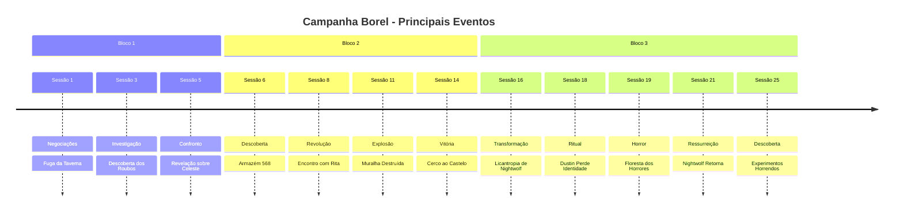

# Cronologia Completa da Campanha Borel

## Por Sessão

### Bloco 1: Início da Jornada (Sessões 1-5)

- [[Sessoes/Capitulo 1 - Negociacoes frustradas|Sessão 1]] - Negociações Frustradas
- [[Sessoes/Capitulo 2 - Um Encontro na cabana|Sessão 2]] - Um Encontro na Cabana
- [[Sessoes/Capitulo 3 - Entre Dados e Desconfianças|Sessão 3]] - Entre Dados e Desconfianças
- [[Sessoes/Capitulo 4 - Noite na Cidade|Sessão 4]] - Noite na Cidade
- [[Sessoes/Capitulo 5 -  Entre Rastros, Risadas e Revelações no Templo|Sessão 5]] - Entre Rastros, Risadas e Revelações no Templo

### Bloco 2: A Revolução (Sessões 6-15)

- [[Sessoes/Capitulo 6 - Investigações e Revelações|Sessão 6]] - Investigações e Revelações
- [[Sessoes/Capitulo 7 - A Carroça Misteriosa|Sessão 7]] - A Carroça Misteriosa
- [[Sessoes/Capitulo 8 - Sussurros de Revolta|Sessão 8]] - Sussurros de Revolta
- [[Sessoes/Capitulo 9 - O Preço da Lealdade|Sessão 9]] - O Preço da Lealdade
- [[Sessoes/Capitulo 10 - Sombras no Cais|Sessão 10]] - Sombras no Cais
- [[Sessoes/Capitulo 11 -Sombras e Pólvora|Sessão 11]] - Sombras e Pólvora
- [[Sessoes/Capitulo 12 – Explosões e Estratégias|Sessão 12]] - Explosões e Estratégias
- [[Sessoes/Capitulo 13 – O Fogo da Revolta|Sessão 13]] - O Fogo da Revolta
- [[Sessoes/Capitulo 14 – O Cerco Final|Sessão 14]] - O Cerco Final
- [[Sessoes/Capitulo 15 – Sombras e Fugas|Sessão 15]] - Sombras e Fugas

### Bloco 3: Transformações (Sessões 16-25)

- [[Sessoes/Capitulo 16 – Sombras do Passado|Sessão 16]] - Sombras do Passado
- [[Sessoes/Capitulo 17 - Entre Cordas e Confissões|Sessão 17]] - Entre Cordas e Confissões
- [[Sessoes/Capitulo 18 - Parte 1 - Nas Estradas para o Santuario|Sessão 18]] - Jornada para Londe
- [[Sessoes/Capitulo 19 - Parte 1 - O Encontro na Floresta dos Horrores|Sessão 19]] - A Floresta dos Horrores
- [[Sessoes/sessao 20_bloco01_resumo|Sessão 20]] - O Legado de Rilonde: Marcas do Ritual
- [[Sessoes/sessao 21_bloco02_resumo|Sessão 21]] - O Ritual da Ressurreição e a Traição
- [[Sessoes/sessao 22_bloco01_resumo|Sessão 22]] - A Batalha das Minhocas Gigantes
- [[Sessoes/sessao 23_bloco01_resumo|Sessão 23]] - A Caverna dos Cogumelos e os Golems Elementais
- [[Sessoes/sessao 24_bloco01_resumo|Sessão 24]] - O Legado de Rilonde: A Batalha Final dos Golems Elementais
- [[Sessoes/sessao 25_bloco01_resumo|Sessão 25]] - O Legado de Rilonde: Os Horrores Subterrâneos

## Por Evento

### Transformações

- **Sessão 16**: Nightwolf revela licantropia
- **Sessão 18**: Dustin perde identidade no ritual da travessia
- **Sessão 18**: Nightwolf controla transformação pela primeira vez
- **Sessão 19**: Bartrock transformado pela máscara metálica
- **Sessão 21**: Nightwolf ressuscitado por Bartrock
- **Sessão 25**: Bartrock desaparece e é substituído por ovelha

### Batalhas Épicas

- **Sessão 14**: Cerco ao Castelo de Alva Cidadela
- **Sessão 19**: Batalha contra criatura monstruosa na Floresta dos Horrores
- **Sessão 22**: Batalha contra minhocas gigantes
- **Sessão 23-24**: Batalha contra golems elementais

### Traições

- **Sessão 9**: Kaelion trai o grupo avisando Rita
- **Sessão 21**: Cerberus revela traição e prende o grupo

### Mortes e Ressurreições

- **Sessão 2**: Morte de Nikov e Lord Bart
- **Sessão 21**: Ressurreição de Nightwolf

### Descobertas Importantes

- **Sessão 6**: Descoberta do Armazém 568 (laboratório secreto)
- **Sessão 18**: Descoberta do ritual apocalíptico na floresta
- **Sessão 25**: Descoberta dos experimentos horrendos

## Timeline Visual

## Links Rápidos

- [[index|Voltar ao Índice Principal]]
- [[Plots/index|Ver Todos os Plots]]
- [[Players/index|Ver Todos os Personagens]]
- [[Locais/index|Ver Todos os Locais]]
- [[Dashboard|Ver Dashboard de Status]]
