# 📊 Estatísticas da Campanha Borel

Uma visão quantitativa e visual do progresso da campanha, personagens e eventos.

## 📊 Visão Geral

### Números Principais

- **🎲 Total de Sessões**: 25
- **👤 Personagens Ativos**: 9
- **📖 Plots Ativos**: 7
- **📖 Plots Resolvidos**: 8
- **🏰 Locais Visitados**: 5 principais
- **👹 NPCs Principais**: 20+

## 📈 Progresso da Campanha

### Distribuição de Plots

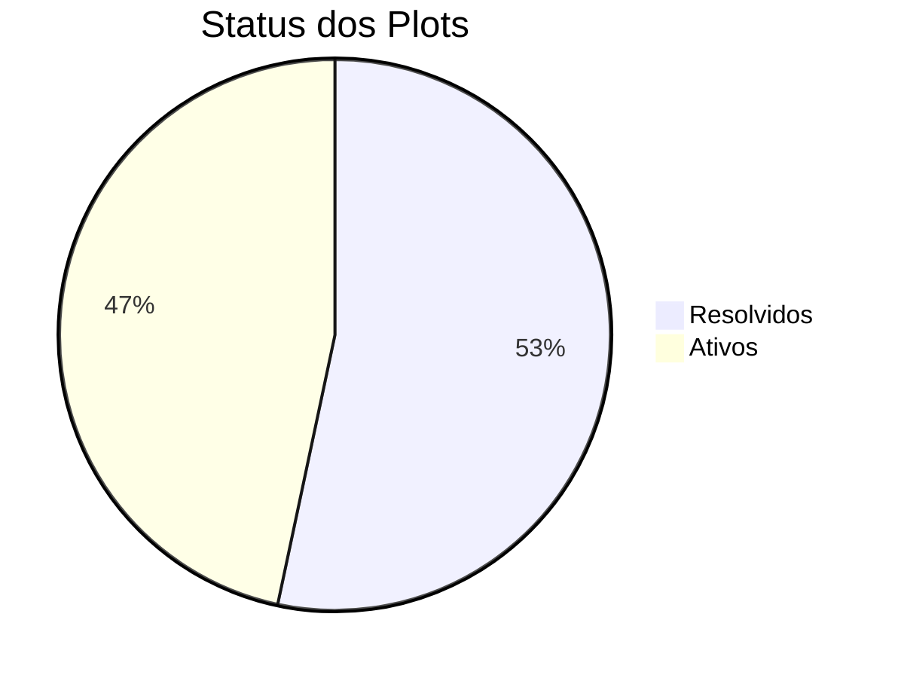

### Plots por Urgência

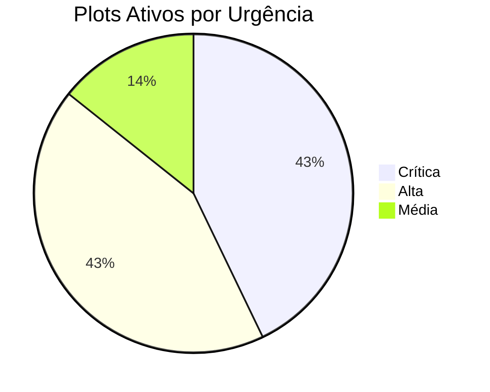

### Progresso por Arco Narrativo

## 👤 Estatísticas de Personagens

### Distribuição por Classe

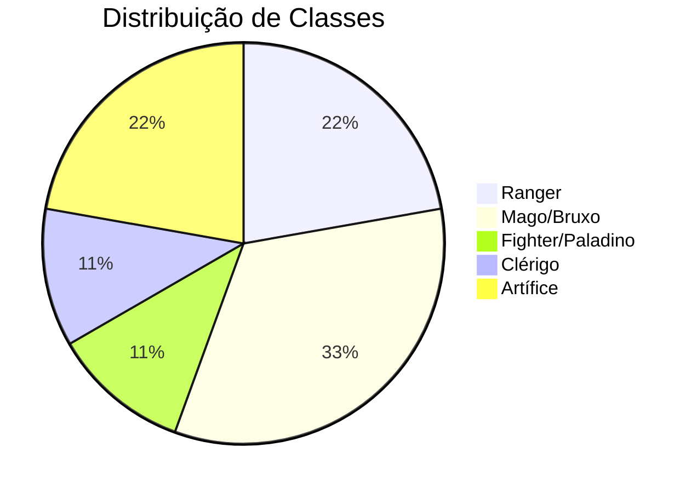

### Status dos Personagens

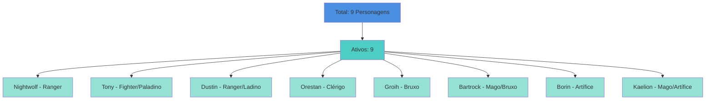

### Níveis dos Personagens

| Personagem | Classe | Nível | Status |
|------------|--------|-------|--------|
| Nightwolf | Ranger | 8 | Ativo |
| Tony | Fighter/Paladino | 8 | Ativo |
| Dustin | Ranger/Ladino | 8 | Ativo |
| Orestan | Clérigo | 8 | Ativo |
| Groih | Bruxo | 8 | Ativo |
| Bartrock | Mago/Bruxo | 8 | Ativo |
| Borin | Artífice | 8 | Ativo |
| Kaelion | Mago/Artífice | 8 | Ativo |

**Nível Médio do Grupo**: 8

## 📅 Métricas de Sessões

### Distribuição por Arco

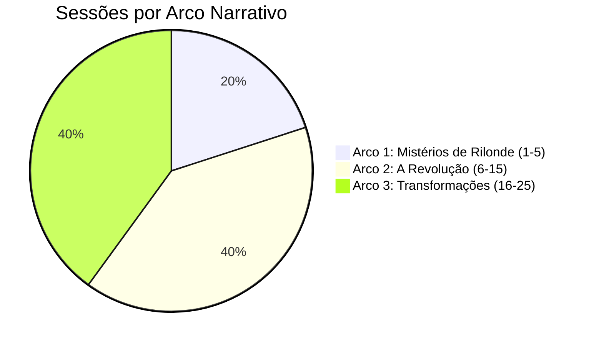

### Eventos por Tipo

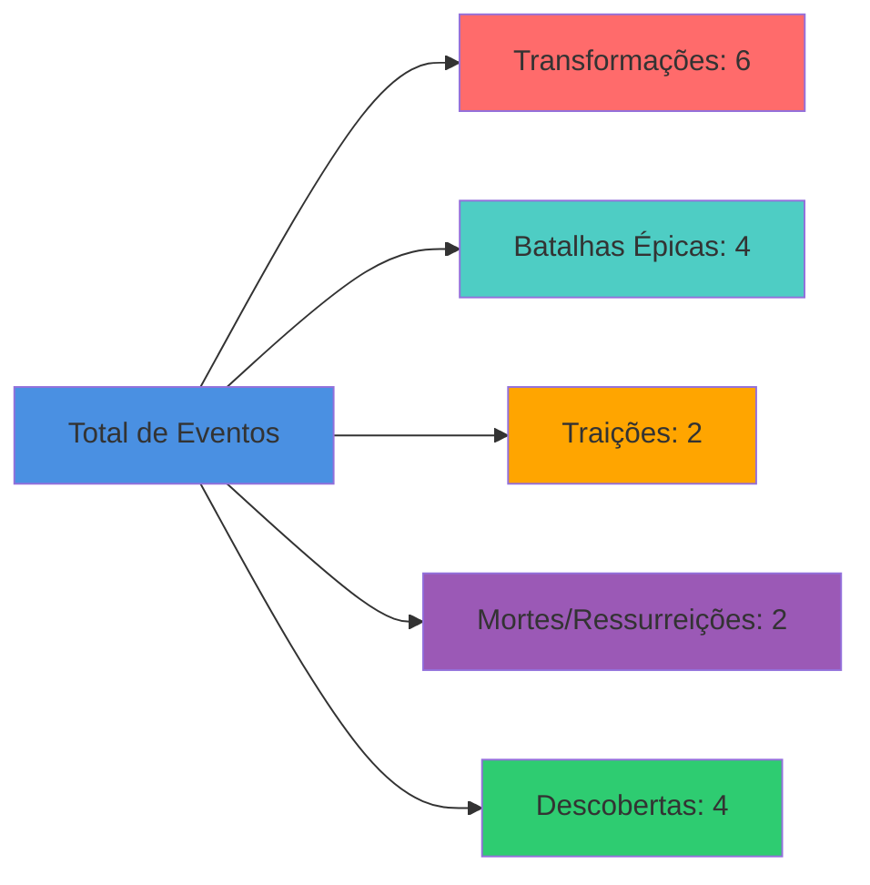

### Timeline de Eventos Importantes

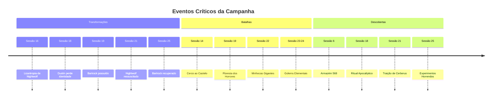

## 🏰 Locais e 👹 NPCs

### 🏰 Locais Visitados

| Local | Status | Controlado Por | Visitas |
|-------|--------|----------------|---------|
| Londe | ✅ Ativo | Conselho Arcano | 3+ |
| Rilonde | ✅ Ativo | Nobreza Comercial | 5+ |
| Elriste | ⚠️ Em Revolução | Resistência (Rita) | 3+ |
| Alva Cidadela | 🏰 Conquistada | Resistência (Rita) | 2+ |
| Santuário de Córdia | ✅ Ativo | Sacerdotes de Córdia | 1+ |

### 👹 NPCs Principais

- **Total de NPCs Documentados**: 20+
- **NPCs Ativos**: 15+
- **NPCs Mortos/Desaparecidos**: 5+
- **NPCs com Plots Próprios**: 8+

## 📊 Análise de Progresso

### Taxa de Resolução de Plots

- **Plots Resolvidos**: 8 (53%)
- **Plots Ativos**: 7 (47%)
- **Taxa de Resolução**: 53%

### Distribuição de Urgência

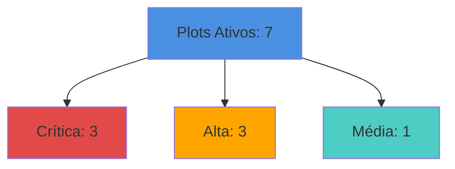

### Evolução do Grupo

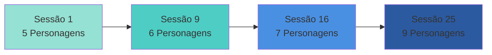

## 🎯 Métricas de Engajamento

### Sessões por Mês (Estimativa)

- **Sessões Completas**: 25
- **Média de Sessões por Mês**: ~2-3
- **Duração Estimada da Campanha**: ~8-10 meses

### Eventos por Sessão

- **Média de Eventos Importantes por Sessão**: 1.5
- **Total de Eventos Críticos**: 18
- **Sessões com Batalhas**: 12 (48%)
- **Sessões com Transformações**: 6 (24%)

## 📈 Tendências

### Crescimento do Grupo

- **Início**: 5 personagens
- **Pico**: 9 personagens (atual)
- **Crescimento**: +80%

### Complexidade dos Plots

- **Plots Simples Resolvidos**: 5
- **Plots Complexos Ativos**: 7
- **Tendência**: Aumento na complexidade dos plots

### Diversidade de Locais

- **Locais Únicos Visitados**: 5
- **Cidades Principais**: 3
- **Locais Especiais**: 2 (Santuário, Cavernas)

## 🔍 Insights

### Padrões Identificados

1. **Transformações**: 6 eventos de transformação, indicando tema central da campanha
2. **Traições**: 2 traições significativas (Kaelion, Cerberus)
3. **Ressurreições**: 1 ressurreição com consequências severas
4. **Descobertas**: 4 descobertas importantes que mudaram o rumo da campanha

### Estatísticas Notáveis

- **Personagem com Mais Transformações**: Nightwolf (licantropia → cura → morte → ressurreição)
- **Plot Mais Longo**: A Possessão de Bartrock (Sessão 16-25, 10 sessões)
- **Arco Mais Intenso**: Arco 2 - A Revolução (10 sessões, múltiplas batalhas)
- **Local Mais Visitado**: Rilonde (5+ visitas)

## 📊 Comparações

### Plots Resolvidos vs Ativos

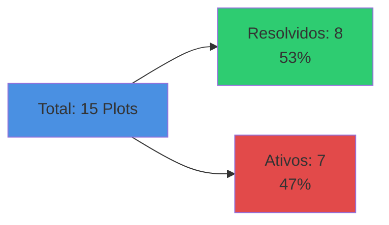

### Distribuição de Classes

- **Magos/Bruxos**: 3 (33%)
- **Rangers**: 2 (22%)
- **Artífices**: 2 (22%)
- **Fighter/Paladino**: 1 (11%)
- **Clérigo**: 1 (11%)

## 🎲 Estatísticas de Jogo

### Níveis

- **Nível Mínimo**: 8
- **Nível Máximo**: 8
- **Nível Médio**: 8
- **Uniformidade**: Todos no mesmo nível (equilíbrio)

### Status dos Personagens

- **100% Ativos**: Todos os 9 personagens estão ativos
- **0% Inativos**: Nenhum personagem inativo ou morto permanentemente
- **Taxa de Sobrevivência**: 100% (considerando ressurreições)

## 📅 Linha do Tempo Estatística

### Eventos por Sessão

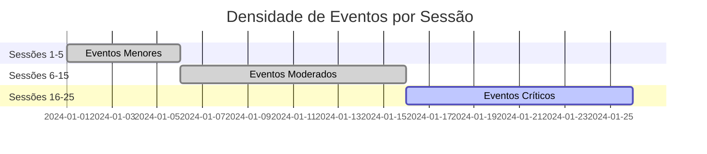

## 🔗 Links Rápidos

- [[Dashboard|Voltar ao Dashboard]]
- [[Cronologia|Ver Cronologia Completa]]
- [[Plots/index|Ver Todos os Plots]]
- [[Players/index|Ver Todos os Personagens]]
- [[Relacionamentos|Ver Mapa de Relacionamentos]]

---

> *"Os números contam uma história, mas a verdadeira aventura está nas conexões entre eles."*
