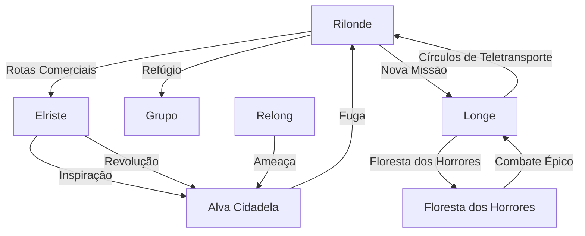

# Locais da Campanha

## Cidades Principais

### [[Rilonde]]
- **Status**: Ativo - Base atual do grupo
- **Tipo**: Centro Comercial
- **Pontos Notáveis**:
  - Porto movimentado
  - [[Armazem_568|Armazém 568]] (destruído)
  - Guilda dos Mercadores
  - **Templo de Megarde** - Cuidados para Jorge
  - **Templo de Chantéia** - Onde rituais falharam
  - **Galpão de Alberto** - Centro de negociações
  - **Taverna com Thaís Carla** - Hospedagem do grupo
- **Personagens Importantes**:
  - [[Alberto]] - Mercador influente (contratou grupo para Longe)
  - [[Celeste]] - Ex-proprietária do Armazém 568 (morta)
  - [[Lucian]] - Braço direito de Alberto (capturado)
  - **[[Thais Carla]]** - Guardiã intimidadora da taverna

### [[Alva Cidadela]]
- **Status**: Em Ruínas
- **Tipo**: Cidade-Fortaleza
- **Pontos Notáveis**:
  - Muralha (parcialmente destruída)
  - Castelo Central (conquistado)
  - Quartel Sul
  - Cavaleiros de Cristal
- **Personagens Importantes**:
  - [[Rita]] (desaparecida)
  - [[Jorge]] - Sobrevivente
  - [[Ivan]] - Ex-chefe da guarda

### [[Elriste]]
- **Status**: Dividida
- **Tipo**: Cidade Portuária
- **Pontos Notáveis**:
  - Muralha Divisória
  - Porto Sul
  - Área Nobre vs. Área Pobre
- **Personagens Importantes**:
  - [[Kaelion]] - Ex-membro do grupo
  - Cavaleiro Misterioso
  - Líderes da Resistência

### Longe
- **Status**: Base Atual do Grupo
- **Tipo**: Cidade da Magia
- **Pontos Notáveis**:
  - Universidade de Magia
  - **Círculos de Teletransporte** - Objetivo da missão
  - Centros de aprendizado arcano
  - **Taverna "Cabeça de Golly"** - Hospedagem do grupo
- **Distância**: 20 hexágonos de Rilonde
- **Recompensa**: 40 platinas por missão bem-sucedida

### Londres
- **Status**: Ativo - Local de Eventos Recentes (Sessão 25)
- **Tipo**: Cidade com Universidade
- **Pontos Notáveis**:
  - **Universidade de Namraf** - Onde grupo defendeu criação de portais
  - **Santuário de Córdia** - Local de rituais de purificação
  - **Caverna Subterrânea** - Local dos experimentos horrendos (relacionada a Cerberus)
  - **Bordel** - Onde Emmergard encontrou seu marido
  - **Taverna** - Onde grupo descansou e se despediu de Emmergard
- **Personagens Importantes**:
  - **[[Leticia|Letícia]]** - Estudante da universidade
  - **Sacerdote de Córdia** - Líder do santuário
- **Eventos Importantes**:
  - Descoberta dos experimentos horrendos
  - Cura do Uruk no Santuário de Córdia
  - Despedida de Emmergard
  - Encontro com Letícia sobre Conselho Arcano

### Floresta dos Horrores
- **Status**: Local de Combate Épico (Sessão 19)
- **Tipo**: Floresta Sombria
- **Pontos Notáveis**:
  - **Criatura Monstruosa** - Derrotada pelo grupo
  - **Espectros Necróticos** - Criaturas invocadas
  - **Máscara Metálica** - Perdida na floresta
  - Ambiente sombrio e perigoso
- **Eventos Importantes**:
  - Combate épico contra criatura gigante
  - Estratégia do Thresh escalando a criatura
  - Explosão devastadora que derrotou a criatura
  - Conflito interno sobre Bartrok e canibalismo

## Mapa de Conexões

## Pontos de Interesse

### Em Rilonde
1. **Porto**
   - Centro de comércio
   - Chegada de mercadorias
   - Ponto de encontro

2. **Armazém 568**
   - Status: Destruído
   - Ex-laboratório de Celeste
   - Local de experimentos misteriosos

3. **Distrito Comercial**
   - Guilda dos Mercadores
   - Mercado Central
   - Tavernas importantes

4. **Templo de Megarde**
   - Onde Jorge está sendo cuidado
   - Proteção divina para órfãos
   - Refúgio sagrado

5. **Templo de Chantéia**
   - Local dos rituais fracassados
   - Rejeitou Nightwolf durante purificação
   - Centro espiritual importante

6. **Galpão de Alberto**
   - Centro de negociações comerciais
   - Escritório principal de Alberto
   - Local das negociações da Sessão 17

7. **Taverna com Thaís Carla**
   - Hospedagem atual do grupo
   - Guardiã intimidadora na entrada
   - Local dos preparativos para viagem

### Em Alva Cidadela
1. **Castelo Central**
   - Cavaleiros de Cristal
   - Salões nobres
   - Local do desaparecimento de Rita

2. **Quartel Sul**
   - Base militar
   - Palco de batalhas
   - Arsenal conquistado

3. **Muralha Externa**
   - Parcialmente destruída
   - Ponto estratégico
   - Símbolo da queda

### Em Elriste
1. **Porto Sul**
   - Local do roubo da pólvora
   - Rota de suprimentos
   - Ponto estratégico

2. **Muralha Divisória**
   - Símbolo da desigualdade
   - Alvo da revolução
   - Ponto de conflito

3. **Área Empobrecida**
   - Base da resistência
   - Rede de informantes
   - Centro da revolta

### Em Longe
1. **Círculos de Teletransporte**
   - Objetivo principal da missão
   - Tecnologia mágica avançada
   - Impacto no comércio regional

2. **Universidade de Magia**
   - Centro de aprendizado arcano
   - Pesquisas mágicas avançadas
   - Possível fonte de conhecimento sobre curas

3. **Distrito Comercial**
   - Beneficiário dos teletransportes
   - Conexões com Alberto
   - Oportunidades futuras

4. **Taverna "Cabeça de Golly"**
   - Hospedagem atual do grupo
   - 15 dias garantidos
   - Base de operações em Longe

### Na Floresta dos Horrores
1. **Local do Combate Épico**
   - Onde ocorreu a batalha contra a criatura monstruosa
   - Estratégia do Thresh escalando a criatura
   - Explosão devastadora que derrotou a criatura

2. **Máscara Perdida**
   - Local onde Tony arremessou a máscara metálica
   - Bartrok afirma ter encontrado
   - Possível local de busca futura

3. **Restos da Criatura**
   - Local onde Bartrok coletou sangue
   - Possíveis propriedades especiais
   - Consequências do canibalismo

### Em Londres
1. **Santuário de Córdia**
   - Local sagrado para seguidores de Córdia
   - Realização de rituais de purificação
   - Onde Uruk foi curado da possessão
   - [[Santuario de Cordia|Ver detalhes]]

2. **Universidade de Namraf**
   - Onde grupo defendeu criação de portais
   - Local de encontro com Letícia
   - Possível conexão com Conselho Arcano do Circo Vermelho

3. **Caverna Subterrânea (Cerberus?)**
   - Local dos experimentos horrendos
   - Entrada relacionada a cão de três cabeças
   - Corredores com celas de criaturas modificadas
   - Missão de resgate planejada

## Eventos Importantes por Local

### Rilonde
1. Investigação dos roubos
2. Descoberta do laboratório
3. Fuga do grupo
4. **Sessão 17**: Preparativos para Longe
5. **Sessão 17**: Negociações com Alberto
6. **Sessão 17**: Jorge no Templo de Megarde
7. **Sessão 17**: Letícia com trabalho

### Alva Cidadela
1. Explosão da muralha
2. Tomada do castelo
3. Desaparecimento de Rita

### Elriste
1. Formação da resistência
2. Roubo da pólvora
3. Traição de Kaelion

### Longe
1. Chegada do grupo
2. Estabelecimento na taverna
3. Preparação para missão dos círculos

### Floresta dos Horrores
1. Encontro com criatura monstruosa
2. Combate épico e estratégia do Thresh
3. Vitória sobre a criatura principal
4. Conflito interno sobre Bartrok
5. Perda e busca pela máscara

## Ameaças Atuais
- **Relong**: Exército se aproximando
- **Alva Cidadela**: Instabilidade pós-revolução
- **Elriste**: Tensões sociais crescentes

## Segredos e Mistérios
1. Túneis secretos na Alva Cidadela
2. Conexões entre as cidades
3. Identidade do Cavaleiro Misterioso
4. Redes de contrabando em Rilonde 