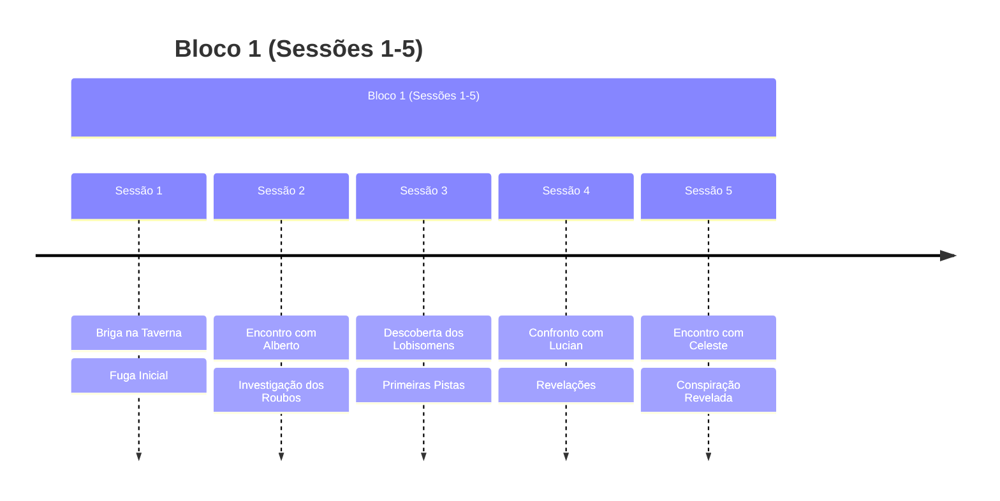
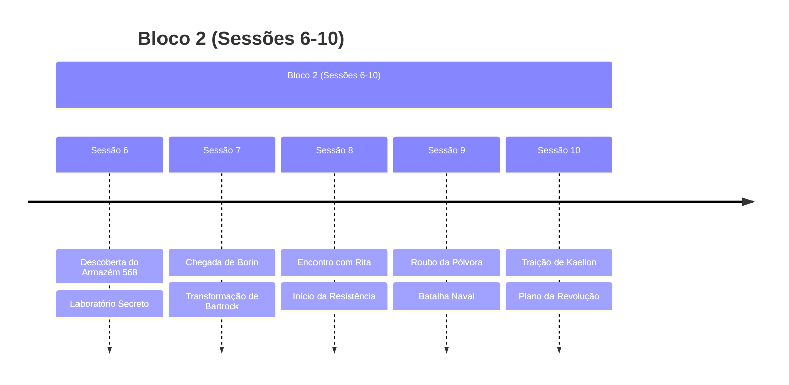
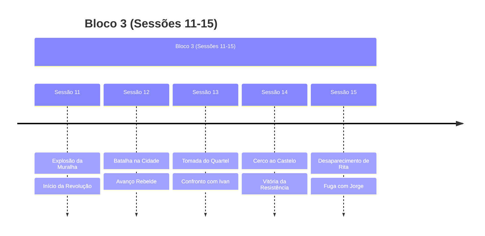
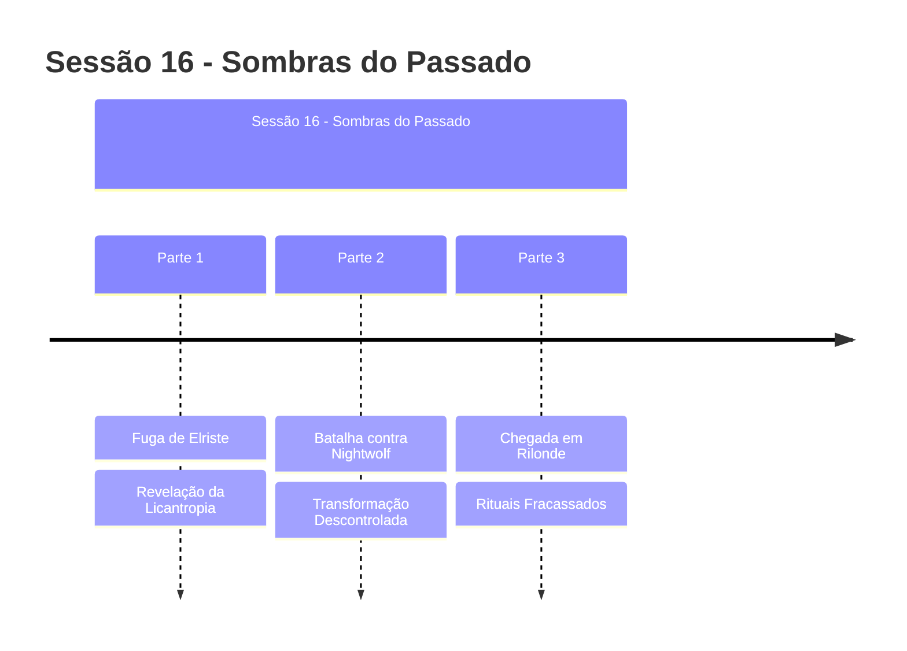
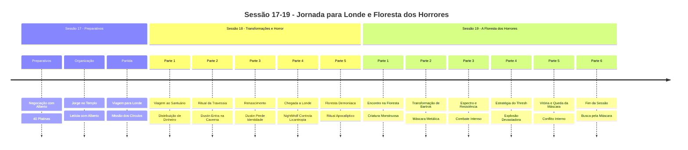
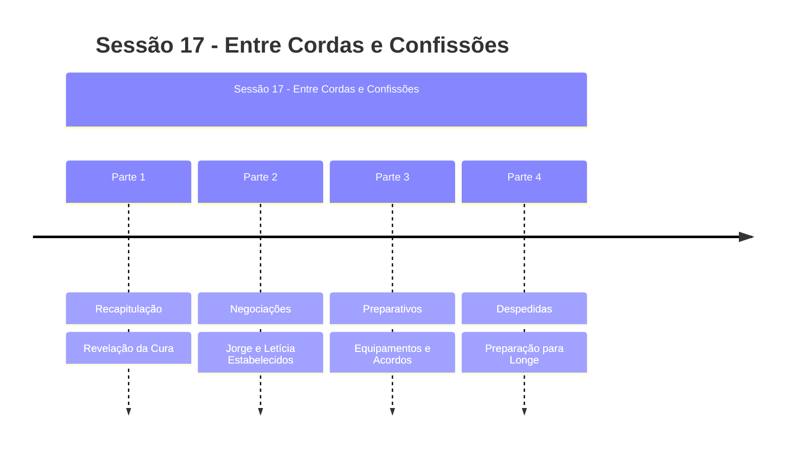

# Plots da Campanha

## Plots Principais Ativos

### 🐺 **A Maldição de Nightwolf**
- **Status**: ATIVO - Cura Descoberta (Sessão 17)
- **Tipo**: Plot Principal - Pessoal
- **Resumo**: Nightwolf revelou-se um lobisomem, mas Bartrock descobriu magia de cura
- **Última Atualização**: Sessão 17
- **Urgência**: ALTA - Cura pendente aplicação

### 😈 **A Possessão de Bartrock**
- **Status**: ATIVO - Máscara Perdida (Sessão 19)
- **Tipo**: Plot Principal - Antagonista
- **Resumo**: Bartrock possuído pela entidade através de máscara metálica, tentou canibalismo, máscara se recusou e caiu
- **Última Atualização**: Sessão 19
- **Urgência**: CRÍTICA - Máscara perdida, Bartrok afirma ter encontrado

### 🔮 **Viagem para Londe**
- **Status**: ATIVO - Chegada Completa (Sessão 18)
- **Tipo**: Plot Principal
- **Resumo**: Grupo chegou a Londe e estabeleceu base na taverna "Cabeça de Golly"
- **Última Atualização**: Sessão 18
- **Urgência**: MÉDIA - Base estabelecida, missão em andamento

### 👨‍👦 **Proteção dos Refugiados**
- **Status**: RESOLVIDO - Estabelecidos (Sessão 17)
- **Tipo**: Plot Secundário
- **Resumo**: Jorge no Templo de Megarde, Letícia trabalhando com Alberto
- **Última Atualização**: Sessão 17

### 🌟 **A Transformação de Dustin**
- **Status**: ATIVO - Ritual Completo (Sessão 18)
- **Tipo**: Plot Principal - Transformação
- **Resumo**: Dustin passou pelo "ritual da travessia" e perdeu sua identidade
- **Última Atualização**: Sessão 18
- **Urgência**: ALTA - Consequências da transformação

### 🎭 **O Ritual Apocalíptico**
- **Status**: ATIVO - Interrompido (Sessão 18)
- **Tipo**: Plot Principal - Ameaça Cósmica
- **Resumo**: Grupo descobriu e interrompeu ritual demoníaco na floresta
- **Última Atualização**: Sessão 18
- **Urgência**: CRÍTICA - Entidades cercaram o grupo

### 👹 **A Criatura Monstruosa**
- **Status**: RESOLVIDO - Derrotada (Sessão 19)
- **Tipo**: Plot Principal - Ameaça
- **Resumo**: Criatura gigante que pode ser a mãe transformada de Bartrok, derrotada pelo grupo
- **Última Atualização**: Sessão 19
- **Urgência**: RESOLVIDO - Criatura derrotada, Bartrok coletou sangue

### 🎭 **A Máscara Metálica**
- **Status**: ATIVO - Perdida (Sessão 19)
- **Tipo**: Plot Principal - Item Mágico
- **Resumo**: Máscara metálica que influenciava Bartrok, se recusou a participar do canibalismo e caiu
- **Última Atualização**: Sessão 19
- **Urgência**: ALTA - Bartrok afirma ter encontrado, grupo duvida

### 🐺 **A Ressurreição de Nightwolf**
- **Status**: ATIVO - Ressuscitado (Sessão 21)
- **Tipo**: Plot Principal - Transformação
- **Resumo**: Nightwolf foi ressuscitado por Bartrok mas com vida máxima reduzida pela metade
- **Última Atualização**: Sessão 21
- **Urgência**: ALTA - Consequências da ressurreição

### 🕳️ **A Armadilha Subterrânea**
- **Status**: ATIVO - Grupo Preso (Sessão 21)
- **Tipo**: Plot Principal - Ameaça Imediata
- **Resumo**: Grupo preso em armadilha subterrânea após traição de Cerberus
- **Última Atualização**: Sessão 21
- **Urgência**: CRÍTICA - Escape urgente necessário

### 🐛 **A Batalha das Minhocas**
- **Status**: ATIVO - Combate em Andamento (Sessão 21)
- **Tipo**: Plot Principal - Combate
- **Resumo**: Grupo enfrenta minhocas gigantes em ambiente subterrâneo, Groin em perigo
- **Última Atualização**: Sessão 21
- **Urgência**: CRÍTICA - Groin em perigo de vida

### 🧪 **Os Experimentos Horrendos**
- **Status**: ATIVO - Descoberto (Sessão 25)
- **Tipo**: Plot Principal - Ameaça Sinistra
- **Resumo**: Instalação subterrânea onde pessoas são transformadas em criaturas modificadas e possuídas
- **Última Atualização**: Sessão 25
- **Urgência**: ALTA - Pessoas ainda sofrendo, missão de resgate planejada

### 🎭 **Conselho Arcano do Circo Vermelho**
- **Status**: ATIVO - Mistério (Sessão 25)
- **Tipo**: Plot Principal - Organização Secreta
- **Resumo**: Organização misteriosa que pode estar relacionada aos experimentos e ao Mardus
- **Última Atualização**: Sessão 25
- **Urgência**: MÉDIA - Informações fragmentadas, investigação planejada

### 🐑 **A Transformação de Bartrock em Ovelha**
- **Status**: ATIVO - Mistério (Sessão 25)
- **Tipo**: Plot Principal - Transformação
- **Resumo**: Bartrock desapareceu durante descanso e foi substituído por uma ovelha com cheiro podre
- **Última Atualização**: Sessão 25
- **Urgência**: ALTA - Localização e condição de Bartrock desconhecidas

## Plots Concluídos Recentemente

### 🏰 [[A Queda da Alva Cidadela|A Queda da Alva Cidadela]]
- **Status**: Concluído (Sessão 15)
- **Tipo**: Plot Principal
- **Resumo**: A revolução liderada por Rita que culminou na queda da cidade-fortaleza

### 🌇 [[Resistencia Elriste|A Resistência em Elriste]]
- **Status**: Concluído/Em Consequências
- **Tipo**: Plot Principal
- **Resumo**: O movimento revolucionário iniciado em Elriste e suas consequências

## Plots Resolvidos

### 🏭 [[Armazem_568|O Mistério do Armazém 568]]
- **Status**: Concluído (Sessão 6)
- **Resumo**: Descoberta e destruição do laboratório secreto de Celeste em Rilonde
- **Desfecho**: Laboratório incendiado, evidências destruídas

### 💣 [[Plano Rebelde|O Plano de Rita]]
- **Status**: Concluído (Sessão 10-11)
- **Resumo**: Plano para derrubar o muro de Elriste usando pólvora roubada
- **Desfecho**: Sucesso na explosão do muro, início da revolução

### 🏃‍♂️ [[Fuga da Taverna|A Fuga da Taverna]]
- **Status**: Concluído (Sessão 1-2)
- **Resumo**: Grupo fugiu após uma briga na taverna
- **Desfecho**: Alguns membros morreram, sobreviventes escaparam

## Linha do Tempo

## Estado Atual da Campanha

### Situação Geral
- **LOCALIZAÇÃO ATUAL**: **PRESOS** em armadilha subterrânea após traição de Cerberus
- **RESSURREIÇÃO**: Nightwolf ressuscitado mas com vida máxima reduzida pela metade
- **AMEAÇA CRÍTICA**: Groin engolido por minhoca, sofrendo dano ácido contínuo
- **COMBATE ATIVO**: Batalha contra minhocas gigantes em ambiente confinado
- **TRAIÇÃO REVELADA**: Cerberus se aliou ao demônio e prendeu o grupo
- **TENSÃO INTERNA**: Conflito crescente entre Tony e Bartrok sobre a máscara
- **URGÊNCIA MÁXIMA**: Escape necessário antes que seja tarde demais

### Locais Importantes
- [[Alva Cidadela]] (em ruínas)
- [[Rilonde]] (base de preparativos, sendo deixada)
- [[Elriste]] (cidade em revolução)
- **Longe** (destino da próxima missão - círculos de teletransporte)

### Tensões Principais
1. **CRÍTICO**: **ESCAPAR DA ARMADILHA** - Grupo preso em salão subterrâneo
2. **CRÍTICO**: **SALVAR GROIN** - Engolido por minhoca, sofrendo dano ácido
3. **CRÍTICO**: **SOBREVIVER AO COMBATE** - Minhocas gigantes em ambiente confinado
4. **ALTA**: Consequências da ressurreição de Nightwolf (vida reduzida)
5. **ALTA**: Traição de Cerberus e aliança com demônio
6. **MÉDIA**: Tensão crescente entre Tony e Bartrok sobre a máscara
7. **BAIXA**: Jorge e Letícia estabelecidos em segurança
8. **BACKGROUND**: Consequências da revolução em Elriste
9. **INCERTO**: Localização e intenções de Rita

## Plots Futuros Potenciais
> [!info] Possibilidades Sessão 21+
> - **PRIORIDADE MÁXIMA**: Escapar da armadilha subterrânea
> - **URGENTE**: Resgatar Groin antes que morra
> - **CRÍTICO**: Derrotar minhocas gigantes e sobreviver
> - **ALTA**: Lidar com consequências da ressurreição de Nightwolf
> - **ALTA**: Confrontar Cerberus sobre sua traição
> - **MÉDIA**: Resolver conflito interno sobre Bartrok e a máscara
> - **MÉDIA**: Investigar aliança de Cerberus com o demônio
> - **BAIXA**: Retomar missão dos círculos de teletransporte em Longe
> - **BAIXA**: Busca por Rita e investigação de seu desaparecimento
> - **BAIXA**: Explorar propriedades do sangue coletado por Bartrok

## Notas do Mestre
> [!note] Lembretes
> - Acompanhar desenvolvimento da transformação de Bartrock
> - Desenvolver consequências da revolução
> - Explorar o passado de Jorge
> - Manter tensão sobre o exército de Relong

## Recursos Relacionados
- [[Rita]] - Líder revolucionária (desaparecida)
- [[Jorge]] - Jovem sobrevivente
- [[Ivan]] - Chefe da guarda derrotado
- [[Celeste]] - Misteriosa spellcaster
- [[Alberto]] - Mercador influente
- [[Lucian]] - Braço direito de Alberto

### Sessões Relacionadas
- [[Capitulo 11 -Sombras e Pólvora|Sessão 11]] - Explosão da muralha
- [[Capitulo 13 – O Fogo da Revolta|Sessão 13]] - Tomada do quartel
- [[Capitulo 14 – O Cerco Final|Sessão 14]] - Cerco ao castelo
- [[Capitulo 15 – Sombras e Fugas|Sessão 15]] - Desaparecimento de Rita 