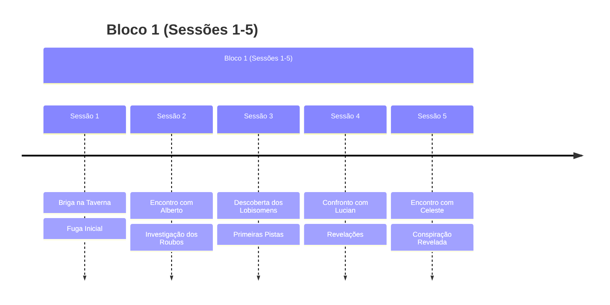
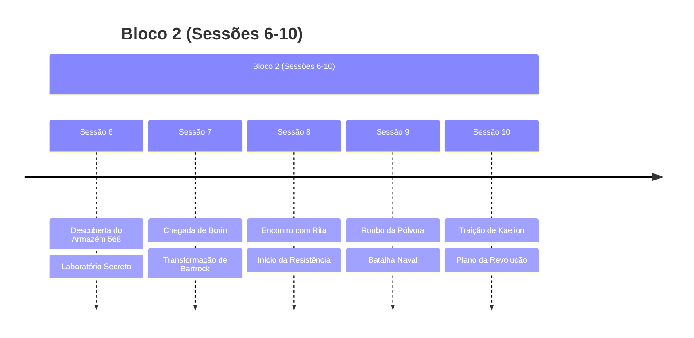
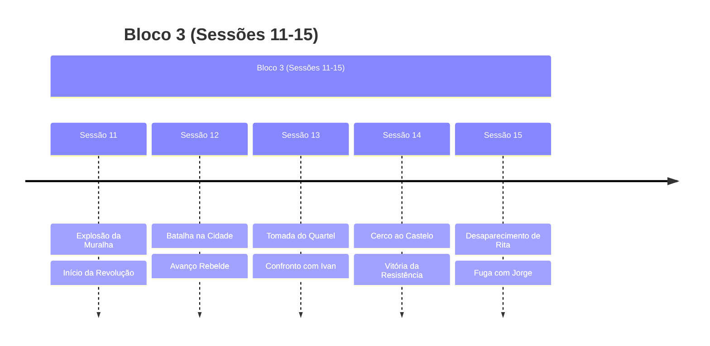

# Plots da Campanha

## Plots Principais Ativos

### 🏰 [[A Queda da Alva Cidadela|A Queda da Alva Cidadela]]
- **Status**: Concluído
- **Tipo**: Plot Principal
- **Resumo**: A revolução liderada por Rita que culminou na queda da cidade-fortaleza
- **Última Atualização**: Sessão 15

### 🌇 [[Resistencia Elriste|A Resistência em Elriste]]
- **Status**: Em Andamento
- **Tipo**: Plot Principal
- **Resumo**: O movimento revolucionário iniciado em Elriste e suas consequências
- **Última Atualização**: Sessão 10

## Plots Resolvidos

### 🏭 [[Armazem_568|O Mistério do Armazém 568]]
- **Status**: Concluído (Sessão 6)
- **Resumo**: Descoberta e destruição do laboratório secreto de Celeste em Rilonde
- **Desfecho**: Laboratório incendiado, evidências destruídas

### 💣 [[Plano Rebelde|O Plano de Rita]]
- **Status**: Concluído (Sessão 10-11)
- **Resumo**: Plano para derrubar o muro de Elriste usando pólvora roubada
- **Desfecho**: Sucesso na explosão do muro, início da revolução

### 🏃‍♂️ [[Fuga da Taverna|A Fuga da Taverna]]
- **Status**: Concluído (Sessão 1-2)
- **Resumo**: Grupo fugiu após uma briga na taverna
- **Desfecho**: Alguns membros morreram, sobreviventes escaparam

## Linha do Tempo

## Estado Atual da Campanha

### Situação Geral
- Grupo em fuga da Alva Cidadela
- Rita desaparecida após incidente com baú mágico
- Jorge sob proteção do grupo
- Exército de Relong se aproximando
- Kaelion traiu o grupo
- Bartrock apresentando transformações misteriosas

### Locais Importantes
- [[Alva Cidadela]] (em ruínas)
- [[Rilonde]] (destino do grupo)
- [[Elriste]] (cidade em revolução)

### Tensões Principais
1. Consequências da revolução
2. Mistério do desaparecimento de Rita
3. Proteção de Jorge
4. Ameaça do exército de Relong
5. Transformação de Bartrock
6. Lealdade de Kaelion à resistência

## Plots Futuros Potenciais
> [!info] Possibilidades
> - Chegada do exército de Relong
> - Investigação do desaparecimento de Rita
> - Descoberta da natureza da transformação de Bartrock
> - Consequências da traição de Kaelion
> - Destino dos refugiados da Alva Cidadela

## Notas do Mestre
> [!note] Lembretes
> - Acompanhar desenvolvimento da transformação de Bartrock
> - Desenvolver consequências da revolução
> - Explorar o passado de Jorge
> - Manter tensão sobre o exército de Relong

## Recursos Relacionados
- [[Rita]] - Líder revolucionária (desaparecida)
- [[Jorge]] - Jovem sobrevivente
- [[Ivan]] - Chefe da guarda derrotado
- [[Celeste]] - Misteriosa spellcaster
- [[Alberto]] - Mercador influente
- [[Lucian]] - Braço direito de Alberto

### Sessões Relacionadas
- [[Capitulo 11 -Sombras e Pólvora|Sessão 11]] - Explosão da muralha
- [[Capitulo 13 – O Fogo da Revolta|Sessão 13]] - Tomada do quartel
- [[Capitulo 14 – O Cerco Final|Sessão 14]] - Cerco ao castelo
- [[Capitulo 15 – Sombras e Fugas|Sessão 15]] - Desaparecimento de Rita 