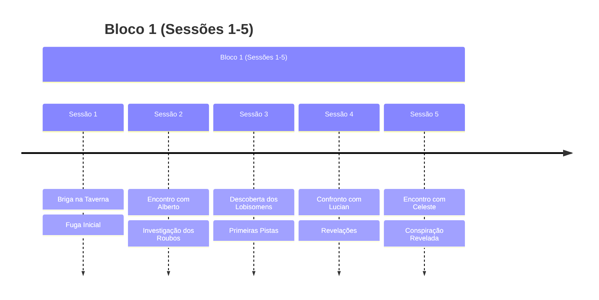
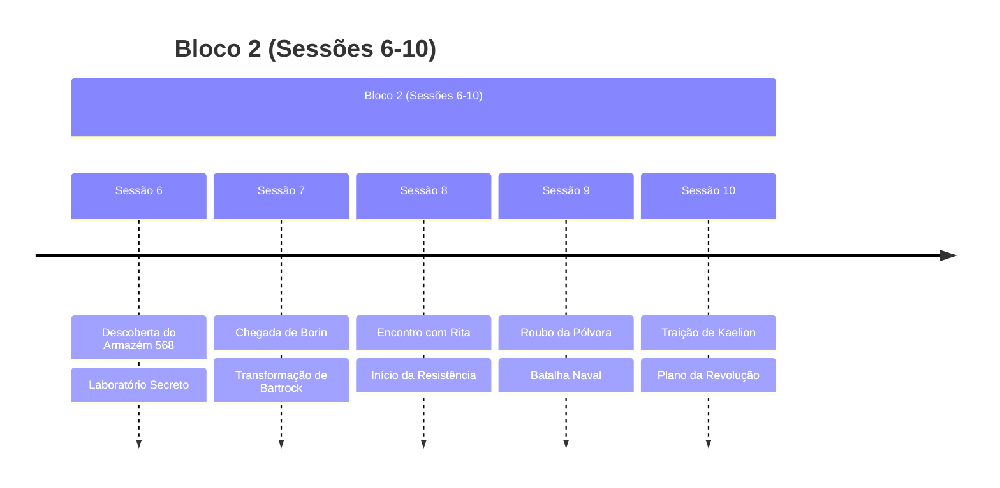
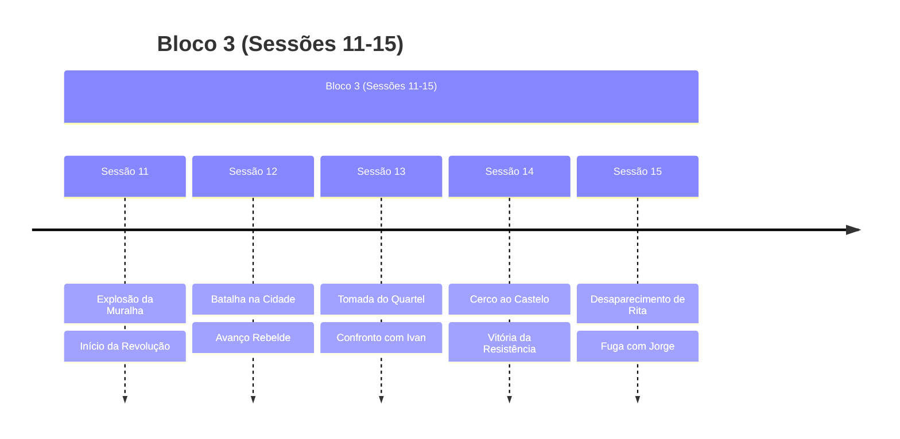
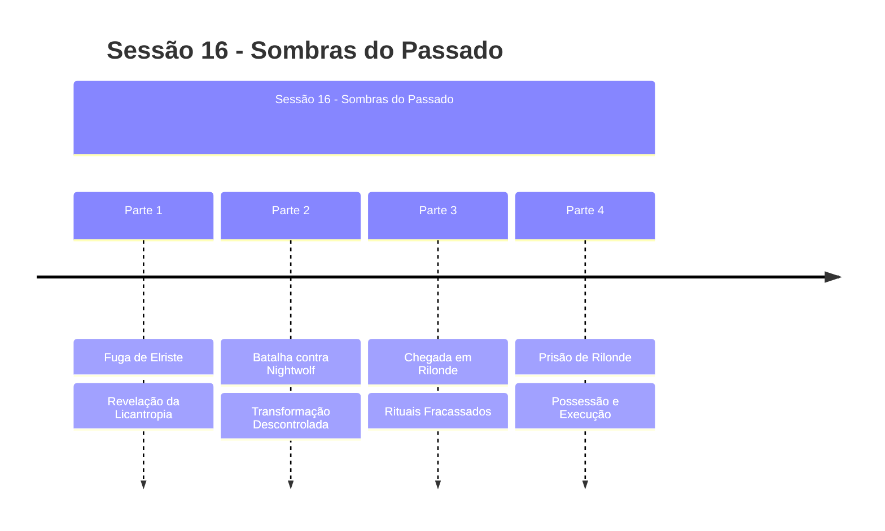
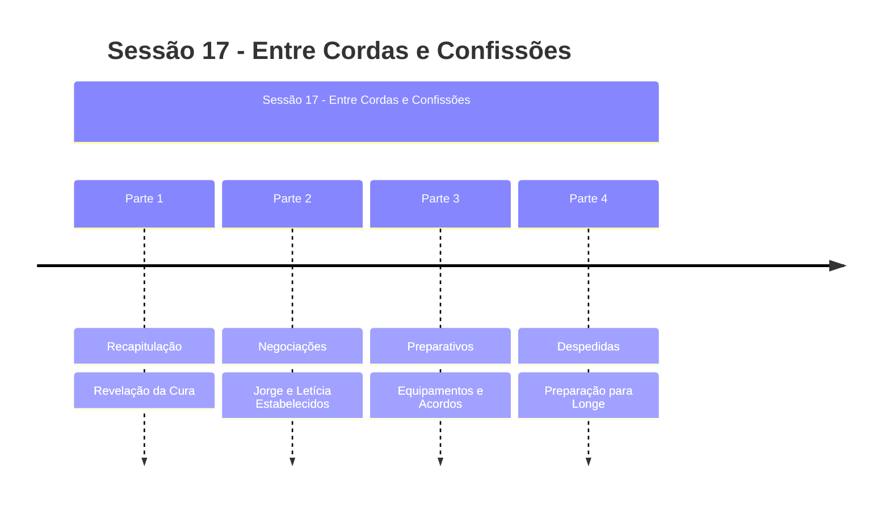

# Plots da Campanha

## Plots Principais Ativos

### 🐺 **A Maldição de Nightwolf**
- **Status**: ATIVO - Cura Descoberta (Sessão 17)
- **Tipo**: Plot Principal - Pessoal
- **Resumo**: Nightwolf revelou-se um lobisomem, mas Bartrock descobriu magia de cura
- **Última Atualização**: Sessão 17
- **Urgência**: ALTA - Cura pendente aplicação

### 😈 **A Possessão de Bartrock**
- **Status**: ATIVO - Entidade Ativa (Sessão 17)
- **Tipo**: Plot Principal - Antagonista
- **Resumo**: Bartrock possuído pela entidade, agora revelando conhecimentos arcanos
- **Última Atualização**: Sessão 17
- **Urgência**: CRÍTICA - Ameaça interna com agenda oculta

### 🔮 **Viagem para Longe**
- **Status**: ATIVO - Contratado (Sessão 17)
- **Tipo**: Plot Principal
- **Resumo**: Grupo contratado por 40 platinas para missão dos círculos de teletransporte
- **Última Atualização**: Sessão 17
- **Urgência**: MÉDIA - Missão bem remunerada

### 👨‍👦 **Proteção dos Refugiados**
- **Status**: RESOLVIDO - Estabelecidos (Sessão 17)
- **Tipo**: Plot Secundário
- **Resumo**: Jorge no Templo de Megarde, Letícia trabalhando com Alberto
- **Última Atualização**: Sessão 17

## Plots Concluídos Recentemente

### 🏰 [[A Queda da Alva Cidadela|A Queda da Alva Cidadela]]
- **Status**: Concluído (Sessão 15)
- **Tipo**: Plot Principal
- **Resumo**: A revolução liderada por Rita que culminou na queda da cidade-fortaleza

### 🌇 [[Resistencia Elriste|A Resistência em Elriste]]
- **Status**: Concluído/Em Consequências
- **Tipo**: Plot Principal
- **Resumo**: O movimento revolucionário iniciado em Elriste e suas consequências

## Plots Resolvidos

### 🏭 [[Armazem_568|O Mistério do Armazém 568]]
- **Status**: Concluído (Sessão 6)
- **Resumo**: Descoberta e destruição do laboratório secreto de Celeste em Rilonde
- **Desfecho**: Laboratório incendiado, evidências destruídas

### 💣 [[Plano Rebelde|O Plano de Rita]]
- **Status**: Concluído (Sessão 10-11)
- **Resumo**: Plano para derrubar o muro de Elriste usando pólvora roubada
- **Desfecho**: Sucesso na explosão do muro, início da revolução

### 🏃‍♂️ [[Fuga da Taverna|A Fuga da Taverna]]
- **Status**: Concluído (Sessão 1-2)
- **Resumo**: Grupo fugiu após uma briga na taverna
- **Desfecho**: Alguns membros morreram, sobreviventes escaparam

## Linha do Tempo

## Estado Atual da Campanha

### Situação Geral
- **LOCALIZAÇÃO ATUAL**: Prontos para partir de Rilonde para Longe
- **ESPERANÇA RENOVADA**: Cura descoberta para Nightwolf
- **AMEAÇA INTERNA**: Bartrock ainda possuído com agenda oculta
- **REFUGIADOS ESTABELECIDOS**: Jorge no templo, Letícia trabalhando
- **MISSÃO CONTRATADA**: 40 platinas por trabalho em Longe
- **GRUPO PREPARADO**: Equipamentos, suprimentos e fundos organizados

### Locais Importantes
- [[Alva Cidadela]] (em ruínas)
- [[Rilonde]] (base de preparativos, sendo deixada)
- [[Elriste]] (cidade em revolução)
- **Longe** (destino da próxima missão - círculos de teletransporte)

### Tensões Principais
1. **CRÍTICO**: Bartrock possuído com agenda oculta da entidade
2. **ALTA**: Aplicação da cura para licantropia de Nightwolf
3. **MÉDIA**: Sucesso da missão em Longe (40 platinas)
4. **BAIXA**: Jorge e Letícia estabelecidos em segurança
5. **BACKGROUND**: Consequências da revolução em Elriste
6. **INCERTO**: Localização e intenções de Rita
7. **NOVO**: Grupos rivais mencionados por Tony

## Plots Futuros Potenciais
> [!info] Possibilidades Sessão 18+
> - **PRIORIDADE**: Aplicação da cura para licantropia de Nightwolf
> - **MISSÃO ATIVA**: Sucesso nos círculos de teletransporte em Longe
> - **Libertação de Bartrock** da possessão maligna
> - **Confronto final** com a entidade maligna
> - **Investigação dos grupos rivais** mencionados por Tony
> - **Busca por Rita** e investigação de seu desaparecimento
> - **Exploração de Longe** e suas oportunidades mágicas
> - **Consequências da separação** de Jorge e Letícia

## Notas do Mestre
> [!note] Lembretes
> - Acompanhar desenvolvimento da transformação de Bartrock
> - Desenvolver consequências da revolução
> - Explorar o passado de Jorge
> - Manter tensão sobre o exército de Relong

## Recursos Relacionados
- [[Rita]] - Líder revolucionária (desaparecida)
- [[Jorge]] - Jovem sobrevivente
- [[Ivan]] - Chefe da guarda derrotado
- [[Celeste]] - Misteriosa spellcaster
- [[Alberto]] - Mercador influente
- [[Lucian]] - Braço direito de Alberto

### Sessões Relacionadas
- [[Capitulo 11 -Sombras e Pólvora|Sessão 11]] - Explosão da muralha
- [[Capitulo 13 – O Fogo da Revolta|Sessão 13]] - Tomada do quartel
- [[Capitulo 14 – O Cerco Final|Sessão 14]] - Cerco ao castelo
- [[Capitulo 15 – Sombras e Fugas|Sessão 15]] - Desaparecimento de Rita 