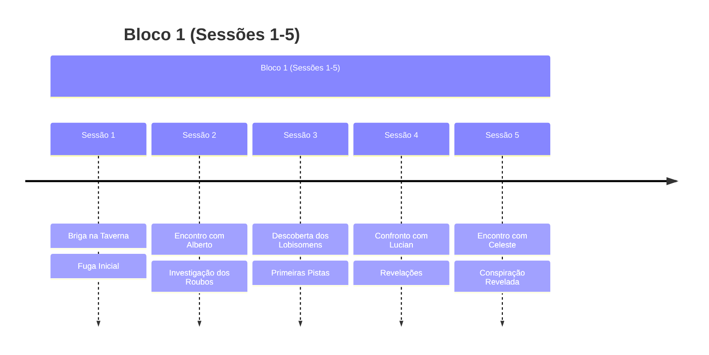
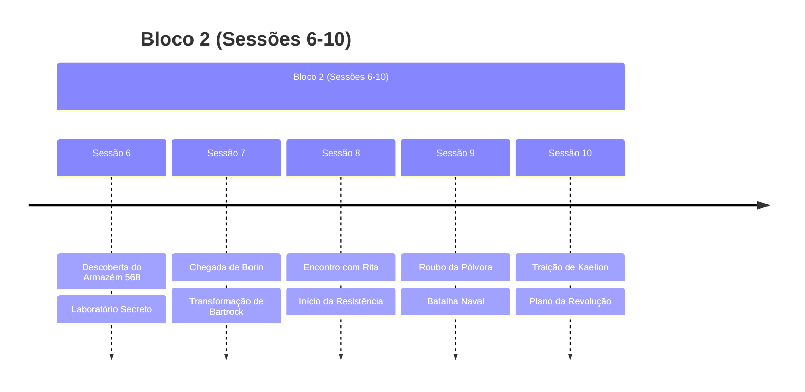
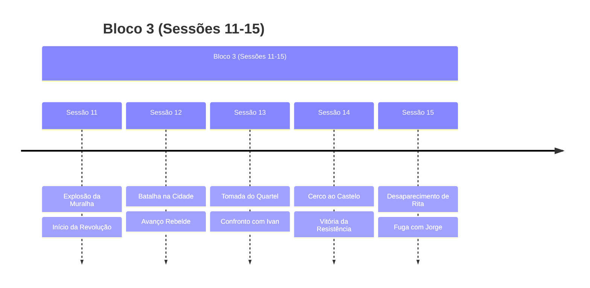
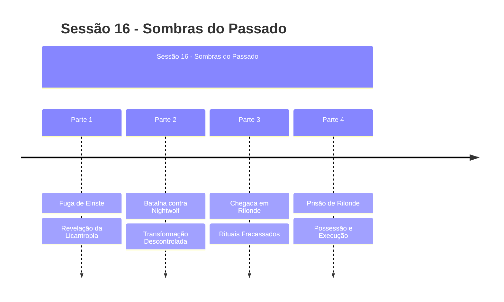

# Plots da Campanha

## Plots Principais Ativos

### 🐺 **A Maldição de Nightwolf**
- **Status**: ATIVO (Descoberto na Sessão 16)
- **Tipo**: Plot Principal - Pessoal
- **Resumo**: Nightwolf revelou-se um lobisomem, transformando-se descontroladamente
- **Última Atualização**: Sessão 16
- **Urgência**: CRÍTICA - Ameaça ao grupo

### 😈 **A Possessão de Bartrock**
- **Status**: ATIVO (Iniciado na Sessão 16)
- **Tipo**: Plot Principal - Antagonista
- **Resumo**: Bartrock foi possuído por entidade maligna através de máscara, executou Celeste
- **Última Atualização**: Sessão 16  
- **Urgência**: CRÍTICA - Ameaça interna

### 🔮 **Os Círculos de Teletransporte**
- **Status**: OFERECIDO (Sessão 16)
- **Tipo**: Plot Secundário
- **Resumo**: Alberto ofereceu trabalho em Longe relacionado aos círculos mágicos
- **Última Atualização**: Sessão 16

## Plots Concluídos Recentemente

### 🏰 [[A Queda da Alva Cidadela|A Queda da Alva Cidadela]]
- **Status**: Concluído (Sessão 15)
- **Tipo**: Plot Principal
- **Resumo**: A revolução liderada por Rita que culminou na queda da cidade-fortaleza

### 🌇 [[Resistencia Elriste|A Resistência em Elriste]]
- **Status**: Concluído/Em Consequências
- **Tipo**: Plot Principal
- **Resumo**: O movimento revolucionário iniciado em Elriste e suas consequências

## Plots Resolvidos

### 🏭 [[Armazem_568|O Mistério do Armazém 568]]
- **Status**: Concluído (Sessão 6)
- **Resumo**: Descoberta e destruição do laboratório secreto de Celeste em Rilonde
- **Desfecho**: Laboratório incendiado, evidências destruídas

### 💣 [[Plano Rebelde|O Plano de Rita]]
- **Status**: Concluído (Sessão 10-11)
- **Resumo**: Plano para derrubar o muro de Elriste usando pólvora roubada
- **Desfecho**: Sucesso na explosão do muro, início da revolução

### 🏃‍♂️ [[Fuga da Taverna|A Fuga da Taverna]]
- **Status**: Concluído (Sessão 1-2)
- **Resumo**: Grupo fugiu após uma briga na taverna
- **Desfecho**: Alguns membros morreram, sobreviventes escaparam

## Linha do Tempo

## Estado Atual da Campanha

### Situação Geral
- **LOCALIZAÇÃO ATUAL**: Taverna em Rilonde
- **CRISE DUPLA**: Nightwolf é lobisomem, Bartrock está possuído
- **REFUGIADOS**: Jorge e Letícia sob proteção do grupo
- **CELESTE MORTA**: Executada por Bartrock possuído
- **OFERTAS PENDENTES**: Trabalho de Alberto em Longe
- **SEGURANÇA COMPROMETIDA**: Ameaças internas ao grupo

### Locais Importantes
- [[Alva Cidadela]] (em ruínas)
- [[Rilonde]] (destino do grupo)
- [[Elriste]] (cidade em revolução)

### Tensões Principais
1. **CRÍTICO**: Bartrock possuído como ameaça interna
2. **CRÍTICO**: Controle da licantropia de Nightwolf
3. **URGENTE**: Proteção de Jorge e Letícia
4. **PENDENTE**: Decisão sobre trabalho em Longe
5. **BACKGROUND**: Consequências da revolução em Elriste
6. **INCERTO**: Localização e intenções de Rita

## Plots Futuros Potenciais
> [!info] Possibilidades Sessão 16+
> - **Libertação de Bartrock** da possessão maligna
> - **Cura da licantropia** de Nightwolf
> - **Missão em Longe** sobre círculos de teletransporte
> - **Confronto final** com a entidade maligna
> - **Busca por Rita** e investigação de seu desaparecimento
> - **Proteção permanente** para Jorge e Letícia
> - **Novas alianças** em Rilonde

## Notas do Mestre
> [!note] Lembretes
> - Acompanhar desenvolvimento da transformação de Bartrock
> - Desenvolver consequências da revolução
> - Explorar o passado de Jorge
> - Manter tensão sobre o exército de Relong

## Recursos Relacionados
- [[Rita]] - Líder revolucionária (desaparecida)
- [[Jorge]] - Jovem sobrevivente
- [[Ivan]] - Chefe da guarda derrotado
- [[Celeste]] - Misteriosa spellcaster
- [[Alberto]] - Mercador influente
- [[Lucian]] - Braço direito de Alberto

### Sessões Relacionadas
- [[Capitulo 11 -Sombras e Pólvora|Sessão 11]] - Explosão da muralha
- [[Capitulo 13 – O Fogo da Revolta|Sessão 13]] - Tomada do quartel
- [[Capitulo 14 – O Cerco Final|Sessão 14]] - Cerco ao castelo
- [[Capitulo 15 – Sombras e Fugas|Sessão 15]] - Desaparecimento de Rita 