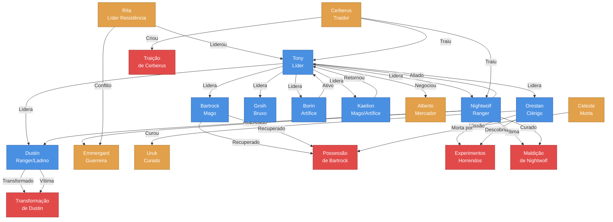

# 🔗 Mapa de Relacionamentos - Campanha Borel

Este documento visualiza as conexões entre 👤 personagens, 👹 NPCs e 📖 plots da campanha.

## Gráfico de Relacionamentos

## 👤 Relacionamentos entre Personagens Jogadores

### Alianças Fortes

- **Tony ↔ Nightwolf**: Aliados próximos desde o resgate na cabana. Tony lidera e Nightwolf protege.
- **Tony ↔ Dustin**: Parceria estratégica, Tony confia em Dustin para investigações.
- **Nightwolf ↔ Dustin**: Companheiros de aventuras e estratégias, trabalham bem em equipe.
- **Orestan ↔ Grupo**: Clérigo confiável, assumiu missão de resgate após curar Uruk.

### Relacionamentos Restaurados

- **Bartrock ↔ Grupo**: Recuperado da possessão, reintegrado ao grupo.
- **Kaelion ↔ Grupo**: Retornou ao grupo após separação anterior.
- **Borin ↔ Grupo**: Ativo e presente com o grupo.

### 👹 Relacionamentos com NPCs

#### Aliados
- **Tony ↔ Alberto**: Relação comercial, Tony negociou contrato de 40 platinas.
- **Nightwolf ↔ Emmergard**: Aliados durante o cerco, testemunharam conflito com Rita.
- **Orestan ↔ Uruk**: Amigos de tribo, Orestan curou Uruk dos experimentos horrendos.

#### Conflitos
- **Rita ↔ Emmergard**: Conflito durante cerco, Rita usou métodos brutais.
- **Cerberus ↔ Grupo**: Traição revelada na Sessão 21, prendeu o grupo em armadilha.

#### Resolvidos
- **Grupo ↔ Celeste**: Executada por Bartrock possuído na prisão de Rilonde.

## 📖 Conexões com Plots

### Plots Ativos que Afetam Relacionamentos

1. **A Possessão de Bartrock**
   - Afeta: Relação do grupo com Bartrock
   - Consequência: Desconfiança e necessidade de proteção

2. **Os Experimentos Horrendos**
   - Afeta: Orestan (missão pessoal de resgate)
   - Consequência: Fortaleceu determinação de Orestan

3. **A Traição de Cerberus**
   - Afeta: Confiança do grupo em aliados
   - Consequência: Maior cautela com novos aliados

### Plots Resolvidos

1. **A Maldição de Nightwolf**
   - Resolvido: Nightwolf curado da licantropia
   - Impacto: Alívio do grupo, Nightwolf mais confiante

2. **A Queda da Alva Cidadela**
   - Resolvido: Revolução completada
   - Impacto: Rita desaparecida, grupo sem líder revolucionário

## 👥 Dinâmicas de Grupo

### Liderança
- **Tony**: Líder natural, toma decisões importantes
- **Nightwolf**: Protetor estratégico, oferece segurança
- **Orestan**: Líder moral, guia missões de resgate

### Especializações
- **Tony**: Combate corpo a corpo, negociação
- **Nightwolf**: Combate à distância, furtividade
- **Dustin**: Investigação, reconhecimento
- **Orestan**: Cura, purificação, missões morais
- **Groih**: Magia ofensiva, suporte arcano
- **Bartrock**: Magia, recuperado da possessão
- **Borin**: Inventor, criações mecânicas
- **Kaelion**: Mago/Artífice, suporte arcano

### Conflitos Internos
- **Kaelion**: Traição causou separação permanente
- **Bartrock**: Possessão cria dilema moral (salvar vs. proteger)

## 📈 Evolução dos Relacionamentos

### Sessões 1-5: Formação do Grupo
- Primeiros encontros e estabelecimento de confiança
- Nightwolf e Tony formam parceria forte

### Sessões 6-15: Revolução
- Grupo unido em missão comum
- Rita como líder externa
- Kaelion trai o grupo (Sessão 9)

### Sessões 16-25: Transformações
- Bartrock possuído (Sessão 16)
- Nightwolf curado (Sessão 18)
- Dustin transformado (Sessão 18)
- Cerberus trai (Sessão 21)
- Orestan assume missão pessoal (Sessão 25)

## Links Rápidos

- [[Players/index|Ver Todos os Personagens]]
- [[NPCs/index|Ver Todos os NPCs]]
- [[Plots/index|Ver Todos os Plots]]
- [[Dashboard|Voltar ao Dashboard]]
- [[Cronologia|Ver Cronologia]]

